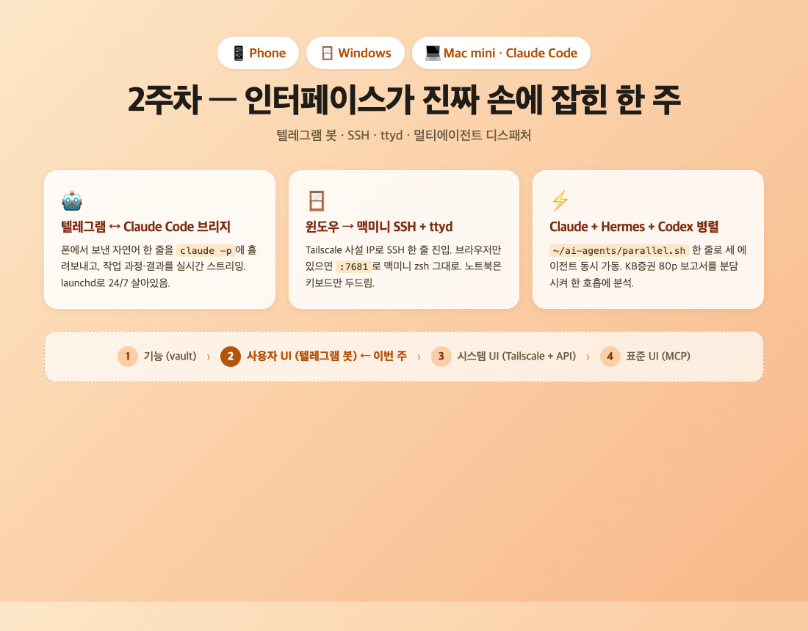
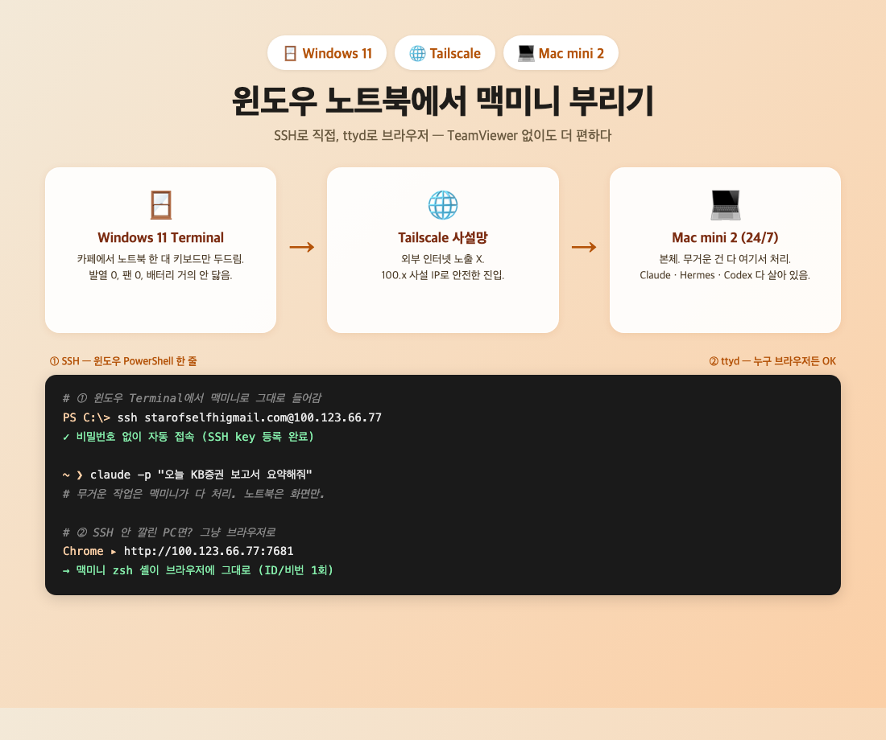
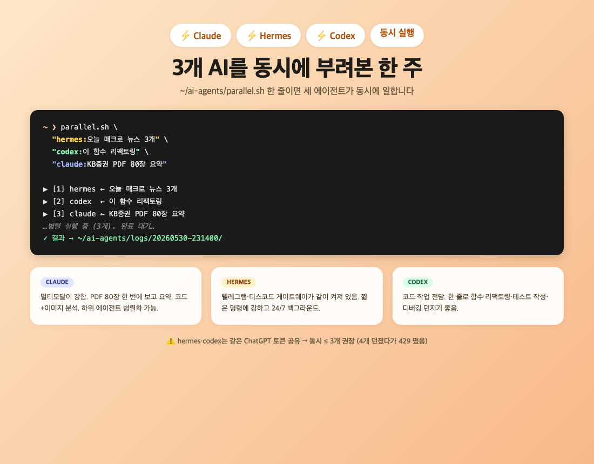

# 지피터스 22기 2주차 수강 후기

안녕하세요. 냐안의별입니다.

지난 주말, 카페에서 폰으로 bit.ly 링크 하나를 던졌어요. 80페이지짜리 증권사 PDF였습니다. 5분 뒤 vault에 챕터별 요약 노트 세 장이 떠 있었어요. 제가 한 거라곤 링크 하나 던진 것뿐이었습니다.

이게 2주차 강의가 약속한 그림 — *"맥미니가 1인 비서, 폰은 그 비서에게 말 거는 전화기"* 가 진짜로 굴러간 한 장면이었어요. 이번 주 후기는 그 한 주 통째 정리입니다.



---

## 수업 전 — 이번 주는 뭘 한다고 했나

1주차에 깔린 그림은 이거였어요.

> **기능(1주차) → 사용자 UI(2주차) → 시스템 UI(3주차) → 표준 UI(4주차)**

이번 주는 **사용자 UI**, 다시 말해 **사람이 직접 손에 들고 쓰는 인터페이스**. 강의 마지막에 강사님이 한 줄 던지셨던 그게 그대로 이번 주제가 됐습니다.

> "2주차 텔레그램 봇이 호출할 게 바로 이 슬래시 커맨드들이다."

저는 사실 1주차 끝나고 일주일 동안 텔레그램 봇을 미리 만들어 둔 상태였어요. 그래서 이번 주는 *"내가 만든 게 강의에서 말한 그 그림에 진짜로 들어맞는가"* 를 확인하는 시간이기도 했습니다.

---

## 수업 중 — 텔레그램 봇이라는 "다리"

핵심 그림은 단순했어요.

```text
폰(텔레그램) ──▶ 봇 ──▶ claude -p "<메시지>" ──▶ 맥미니의 vault 작업
                                              ──▶ 결과를 다시 텔레그램으로
```

봇은 **두뇌가 아니라 다리**라는 게 가장 큰 포인트였습니다. 헤르메스처럼 모델이 봇 안에 들어있는 게 아니라, **봇은 그냥 메시지를 받아 `claude` CLI에 흘려보내는 통로**. 두뇌는 어디까지나 맥미니의 Claude Code예요.

그래서 폰에서 보낸 자연어 한 줄이 → 맥미니 안에서 파일을 만들고, 코드를 고치고, MCP 서버를 부르고, 결과를 다시 폰으로 흘려보냅니다. 폰이 키보드가 되고, 맥미니가 본체가 되는 구조.

이번 강의에서 새로 배운 거 정리하면:

- **BotFather에서 봇 토큰 받기** — 사실상 "봇 만들기"의 99%
- **봇 코드는 long-polling 한 파일이면 끝** — 외부 의존성 0개로도 충분
- **launchd로 부팅 시 자동 실행** — `KeepAlive: true`만 켜두면 죽어도 알아서 살아남
- **`--output-format stream-json`** — Claude가 지금 뭘 하는지 한 줄씩 보내줘서 폰에서도 진행상황이 보임 (헤르메스풍)
- **`bypassPermissions`** — 폰에서는 "이거 해도 돼?" 팝업을 띄울 데가 없으니 미리 켜둬야 함
- **`--resume <세션ID>`** — 메시지끼리 맥락이 이어지게. `/new` 치면 새 대화

봇 코드는 사실상 이렇게 한 폴더 안에 다 들어있어요.

```text
~/telegram-vault-bot/
├── bot.py         # 메인 (long-polling + claude 실행 + 스트리밍)
├── set-token.py   # BotFather 토큰 안전 저장 스크립트
├── .env           # 토큰·허용 유저·작업 폴더·권한 (600, git X)
├── state.json     # 세션 ID 보관 (대화 맥락 유지용)
├── bot.out.log    # 표준 출력
└── bot.err.log    # 에러
```

이걸 다 합치면, 폰에서 보낸 "오늘 일지 정리해줘" 한 마디가 맥미니의 vault에 그대로 노트 한 장으로 떨어집니다. 이게 진짜 됩니다.

> 💬 **체감 사례:** 지난 일주일 동안 이 봇이 폰에서 받은 사진·파일만 **22개**입니다. 모임 사진, 화이트보드 메모, 자료 PDF — 폰에서 텔레그램으로 쏘면 맥미니의 `~/gpters-photos/`에 알아서 떨어져요. 1주차 후기에 들어간 사진들도 다 이렇게 들어왔습니다.

자세한 봇 구조·운영 방법은 [[2026-05-23-telegram-vault-bot]] 노트로 따로 정리해뒀습니다.

---

## 수업 후 — 1주일 동안 진짜로 시켜본 것들

여기부터는 강의에서 직접 다룬 건 아니지만, 1주차 끝나고 2주차까지 일주일 동안 **실제로 폰·노트북에서 맥미니 1·2번에 시키면서** 알게 된 것들이에요. 강의에서 깔린 그림이 일상에 어떻게 녹는지 보여드리고 싶어서 한 묶음으로 남깁니다.

---

### 🪟 1) 윈도우 노트북에서 맥미니에 작업 시키는 게 — 진짜 신세계

이게 이번 주에 제일 좋았던 부분입니다.



저는 평소에 **윈도우 노트북**도 자주 씁니다. 외출할 때, 카페에서 글 쓸 때, 거실 소파에서. 그동안은 윈도우에선 윈도우대로, 맥미니는 화면 공유(TeamViewer)로 따로따로 썼는데, 이제는 그럴 필요가 없어요.

지금은 윈도우 노트북에서 이렇게 합니다:

#### ✅ SSH — 그냥 윈도우 터미널에서 맥미니로 들어감

윈도우 11 PowerShell이나 Windows Terminal에서:

```bash
ssh <맥미니계정>@<Tailscale-IP>
```

이거 한 줄이면 맥미니2 안에 들어가 있습니다. (IP는 Tailscale이 깔아준 사설 IP고, 1주차 끝나고 깐 Tailscale이 여기서 진가를 발휘했어요.)

들어간 뒤엔 그냥 맥미니 본체에 앉아있는 거랑 똑같아요.

- `claude -p "오늘 KB증권 보고서 요약해줘"` 한 줄이면 맥미니에서 Claude가 돕니다.
- `hermes -z "...."` 도 동일.
- vault 안 파일도 그냥 `vim`이나 `nano`로 고침.
- 무거운 작업도 윈도우 노트북 배터리가 아니라 **맥미니가 다 처리**. 노트북은 키보드만 두드림.

처음 했을 때 솔직히 "이게 왜 이렇게 좋지?" 싶었어요. **노트북 발열도 없고, 팬도 안 돌고, 배터리도 안 닳습니다.** 무거운 건 다 맥미니가 합니다.

#### ✅ ttyd — 브라우저에서 맥미니 터미널을 그대로

SSH는 좋은데, 가끔 SSH가 안 깔린 환경(공용 PC, 누구 노트북 빌렸을 때 등)에서도 맥미니를 만지고 싶을 때가 있더라고요. 그래서 깐 게 **ttyd**예요.

ttyd는 **터미널을 브라우저로 보여주는 도구**입니다. 맥미니에서 한 번 띄워두면, 어디서든 브라우저로 `http://<Tailscale-IP>:7681` 열고 ID/비번 한 번 치면 맥미니 zsh 셸이 그대로 떠요.

설정도 간단했어요. `brew install ttyd` → launchd plist 한 장 (포트 7681, 입력 허용, basic auth, 로그인 셸) → 끝. **브라우저만 있으면 맥미니 터미널이 손바닥에 들어옵니다.** 자세한 옵션은 [[web-terminal]] 노트로 따로 정리해뒀어요.

카페 모니터에서, 누구 아이패드에서, 심지어 폰 브라우저에서도 됩니다. (폰은 키보드가 작아서 텔레그램 봇이 더 편하긴 합니다.)

> 💡 **보안 메모:** ttyd를 외부 인터넷에 노출하면 위험합니다. **Tailscale 안에서만** 접근되게 막아뒀고, basic auth도 켰어요. 공개 사이트엔 IP·계정명 마스킹도 같이 적용했습니다.

#### ✅ 정리하면

| 상황 | 도구 |
|---|---|
| 윈도우 노트북에서 키보드 작업 | **SSH** |
| 누구 컴퓨터 빌렸을 때 / 브라우저만 됨 | **ttyd** |
| 폰 들고 자연어로 시키고 싶음 | **텔레그램 봇** |
| 폰에서 화면 직접 봐야 함 | TeamViewer (옛날 방식, 가끔만) |

그동안 TeamViewer 하나로 다 떼웠는데, 셋으로 나뉘니까 **각자 진짜 잘하는 일만 합니다**. 화면 공유 안 해도 되니까 데이터도 거의 안 쓰고, 노트북도 시원해요. 1주차 강의 동기였던 *"어떻게 하면 핸드폰에서도 맥미니에서 직접 작업하는 것처럼 AI 도구들을 사용할 수 있을까?"* 라는 질문이, 이번 주를 거치면서 **폰·윈도우 노트북·브라우저 세 갈래로 동시에 풀린** 느낌입니다.

(원격 작업 큰 그림은 [[remote-work]] 노트 참고.)

---

### ⚡ 2) 헤르메스 + 클로드 + 코덱스를 같이 굴리기 시작함

저는 그동안 **헤르메스(텔레그램·디스코드 봇)**, **클로드 코드**, **코덱스 CLI** 를 따로따로 썼어요. 그런데 이번 주에 처음으로 **세 놈을 동시에 굴리는 방법**을 알게 됐습니다.



(이건 강의 범위 밖이라 짧게.) 핵심은 `~/ai-agents/`에 둔 작은 셸 스크립트 두 개예요.

```bash
~/ai-agents/parallel.sh \
  "hermes:오늘 매크로 뉴스 3개" \
  "codex:이 함수 리팩토링" \
  "claude:KB증권 PDF 80장 요약"
# → 셋이 동시에 돌고, ~/ai-agents/logs/<시각>/에 결과 모임
```

한 줄 치면 **셋이 동시에 뜁니다.** KB증권 80페이지짜리 하반기 전략 보고서를 분석할 때 — 한 손으로 들고 있기 무거워서 **클로드 하위 에이전트 3개**에게 챕터별로 분담시켰는데 너무 잘 돌아서 신기했어요. 같은 원리로 헤르메스·코덱스까지 묶으면 더 큰 일도 동시에 분할 가능합니다.

> ⚠️ **삽질 노트**: hermes·codex가 같은 ChatGPT 토큰을 공유하더라고요. 한 번에 4개 이상 동시에 굴렸다가 429 (요청 너무 많음) 떴어요. 그래서 동시 실행 ≤3 권장.

---

### 🤖 3) 텔레그램 봇이 진짜 손이 되는 순간들

지난 일주일 동안 폰 텔레그램으로 진짜 별별 걸 다 시켰는데, 그중 인상 깊었던 거 몇 개.

1. **새벽에 누워서 일지 쓰기** — "오늘 한 일 정리해서 vault에 넣어줘" 한 줄. 5분 뒤 vault에 노트 한 장이 떠 있음.
2. **외출 중에 갑자기 떠오른 종목 메모** — "두산에너빌리티 어제 종가랑 KB증권 보고서 언급 내용 정리해서 Stocks/에 저장" 같은 거.
3. **이번 주 KB 보고서 다운로드 + PDF 분리 + 요약 + Obsidian 저장** — 이게 진짜 압권. 카페에서 폰으로 bit.ly 링크 하나 던졌더니, 맥미니가 알아서 PDF 받고, 80장으로 분리하고, 챕터별 요약하고, Obsidian에 저장하고, 인덱스까지 업데이트. *"내가 한 거라곤 링크 하나 던진 것뿐"* 인 게 신기했어요.
4. **사진 자동 저장** — 폰에서 텔레그램으로 사진 쏘면 `~/gpters-photos/`에 자동으로 들어옴. 1주차 후기 사진들이 다 이렇게 들어온 거예요.

특히 ③ 같은 흐름이 진짜 **"맥미니가 1인 비서고, 폰은 그 비서한테 말 거는 전화기"** 그림을 실감하게 해줬습니다.

---

### 📊 4) 한 주 동안 vault에 쌓인 것들 — 진짜 작업내역

말로만 하면 와닿지 않을 것 같아서, 한 주간 `llm-wiki` 저장소에 쌓인 커밋을 카테고리별로 묶었습니다.

| 카테고리 | 건수 | 대표 |
|---|---|---|
| AI 데일리 다이제스트 | 8 | 매일 밤 10시 자동화 |
| 홈페이지 인프라 | 6 | Quartz 빌드, GitHub Pages 워크플로, 디자인 |
| 인덱스·허브 노트 | 4 | obsidian/claude/ssh 등 키워드 정리 |
| 보안 · 마스킹 | 2 | Tailscale IP·계정명 마스킹, ttyd 비번 인증 |
| 작업일지·후기 | 2 | 5/23 작업일지, 오프라인 모임 후기 반영 |
| 페르소나·메타 | 2 | 에이전트 톤 정립 |
| 리서치 | 1 | Hashed AI 에이전트 경제 딥리서치 |
| **합계** | **25** | (8일간) |

이 중에서 **체감상 80% 이상**이 폰 텔레그램이나 윈도우 노트북 SSH로 시킨 거예요. 맥미니 앞에 직접 앉아서 친 건 진짜 몇 개 안 됩니다. 특히 데일리 다이제스트는 *"오늘 AI 뉴스 정리해서 다이제스트 노트 만들고 커밋해줘"* 한 줄로 끝나요.

---

### 🐛 5) 일주일 동안 한 삽질들 (이게 진짜 후기)

매끄럽게 된 건 하나도 없어요. 다 삽질이었는데, 그중 남에게도 도움될 만한 거 셋만 추립니다.

1. **헤르메스 토큰 만료 사건** — 헤르메스 봇이 "메시지는 받는데 답을 못 하는" 좀비 상태였어요. 알고 보니 GPT 계열 OAuth 토큰이 만료. `hermes auth` 재인증으로 살림. **헤르메스랑 코덱스가 같은 ChatGPT 토큰을 공유**하는 걸 이때 처음 알았어요. (관련: [[2026-05-23-worklog]])

2. **봇이 자기를 재시작하다 끊김** — "봇 재시작해줘" 시켰는데, 그 봇이 자기를 죽이는 셈이라 답을 못 받음. 해결: `(sleep 30; launchctl kickstart -k gui/$(id -u)/com.starofself.vaultbot) &` 처럼 **지연 재시작**.

3. **SSH 토글이 GUI에서만 되는 거** — 맥미니에서 터미널로 `systemsetup -setremotelogin on` 했더니 "Full Disk Access 없음"으로 막힘. 결국 시스템 설정 → 일반 → 공유 → 원격 로그인 토글로 해결. (모르고 30분 헤맴)

이런 거 하나하나가 그때는 짜증나는데, 끝나고 보면 **"아 이렇게 굴리는 거구나"** 가 몸으로 박힙니다. 다음에 비슷한 거 나오면 1분 만에 해결됨.

---

## 마무리

1주차에 "vault라는 기능 계층"이 깔렸다면, 2주차엔 **그 vault를 어디서든 부를 수 있는 인터페이스 계층**이 얹어졌습니다. 부르는 방법이 텔레그램 봇 하나만이 아니더라고요 — SSH, ttyd, 멀티에이전트 디스패처. 상황마다 손에 잡히는 가장 편한 도구를 골라 쓰는 그림이 됐어요.

이번 주 한 줄 수확:

> **"맥미니가 풀려서 내 옆에 따라다니는 느낌."**

어디서 키보드를 두드리든 결국 맥미니가 일을 합니다.

**강의에 살짝 아쉬웠던 건** — 텔레그램 봇 만들기까지는 잘 따라갔는데, 봇 운영 후 안정성·디버깅(launchd 재시작 타이밍, 토큰 만료 같은 운영 함정) 얘기가 없어서 일주일 동안 혼자 부딪히며 알아갔어요. 3주차 Tailscale + API 들어가기 전에 한 줄이라도 짚어주시면 좋겠다는 생각이.

다음 주는 **시스템 UI(3주차) — Tailscale + API**. 이번 주 SSH/ttyd가 이미 Tailscale 위에서 굴렀으니 도입은 부드러울 것 같고, API까지 더해지면 다음 단계 그림이 나옵니다. 4주차 MCP까지 가면 헤르메스·코덱스까지 한 호흡으로 묶이는 그림이 진짜 완성되지 않을까 싶어요.

> 💡 **혹시 따라 해보고 싶으시다면** — BotFather에서 봇 토큰 하나 받는 것부터 시작해보세요. 그게 99%입니다. 나머지는 launchd + `claude -p` 한 줄이면 다 굴러갑니다.

다음 주에 뵙겠습니다.

냐안의별 이었습니다. 🙌
