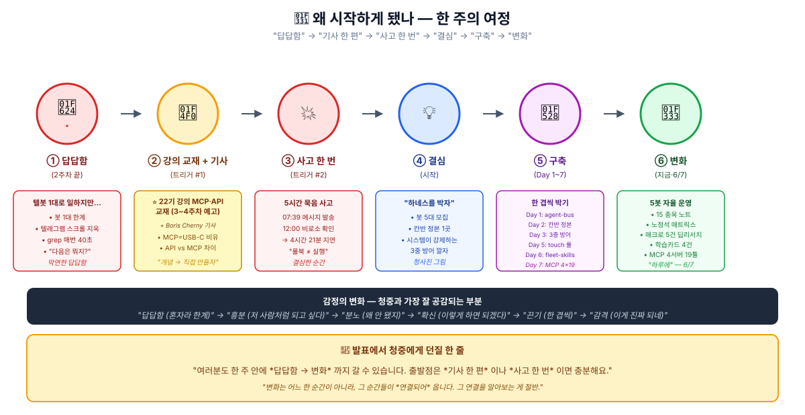
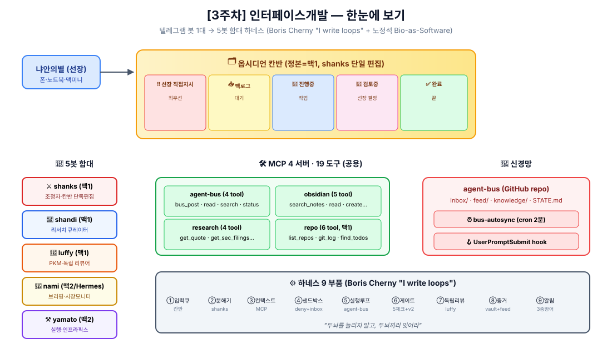
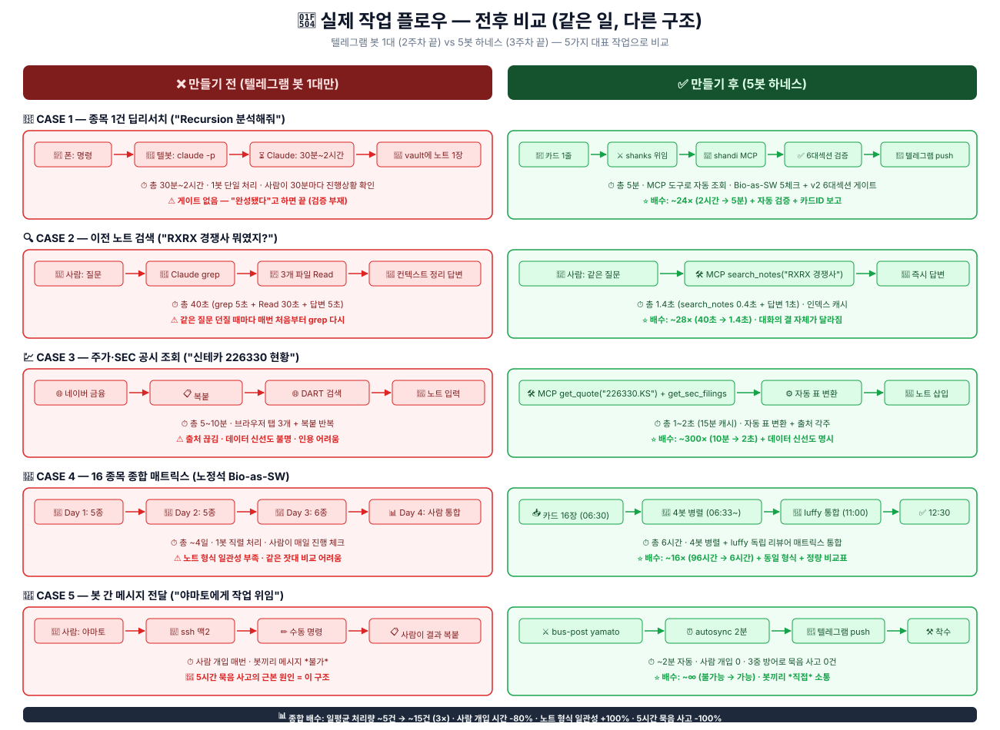
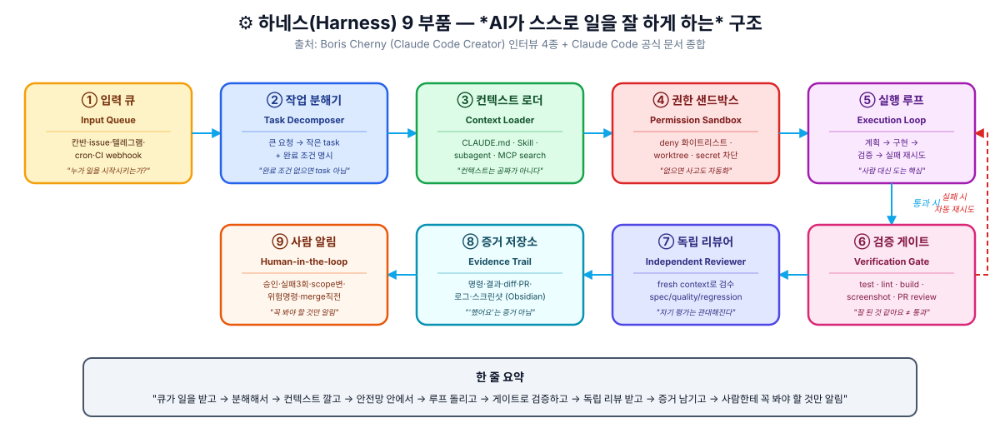
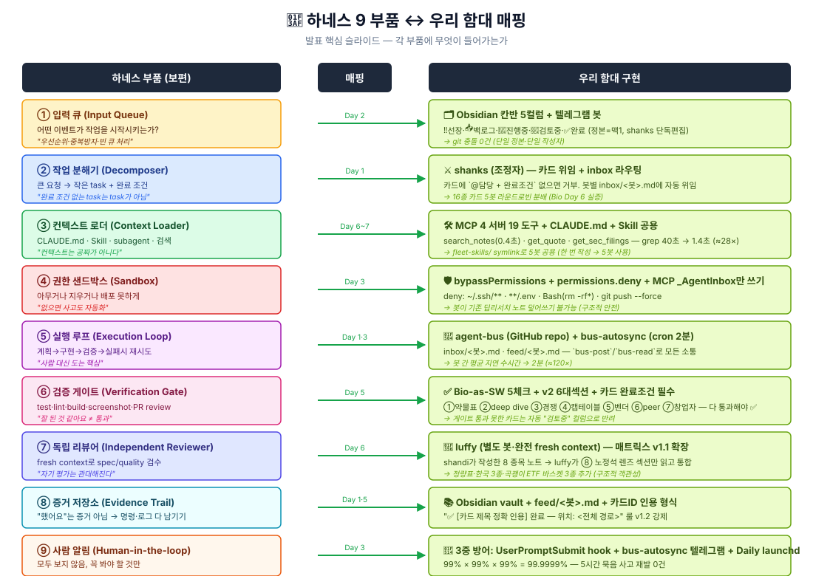
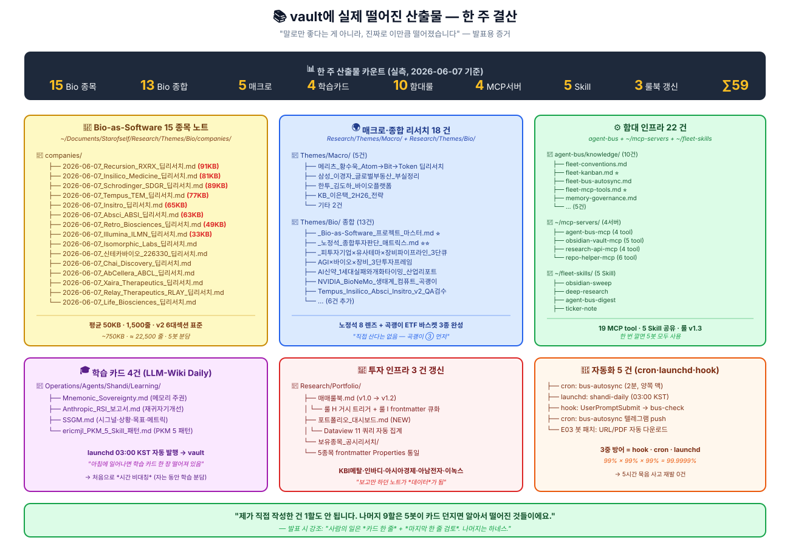
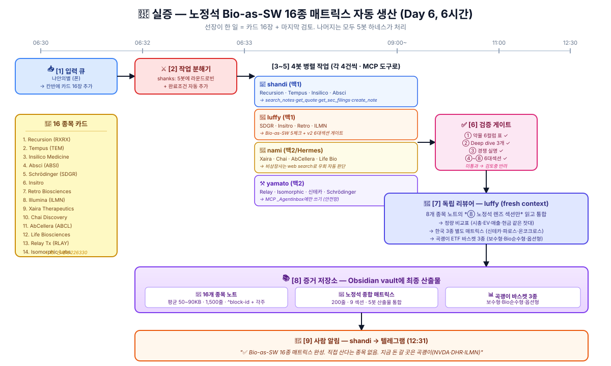
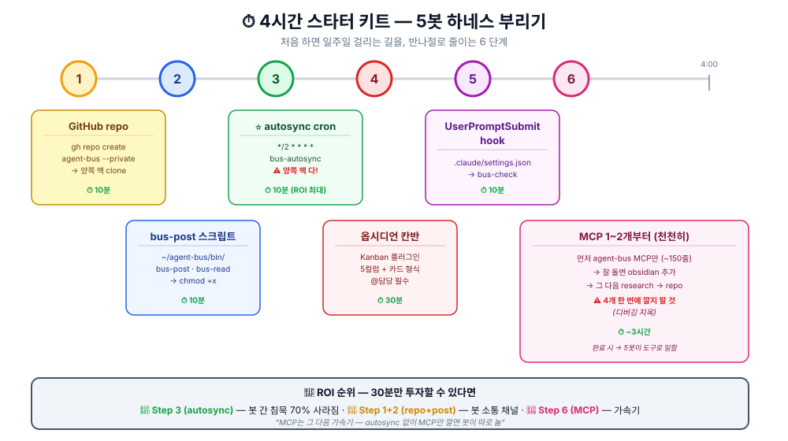
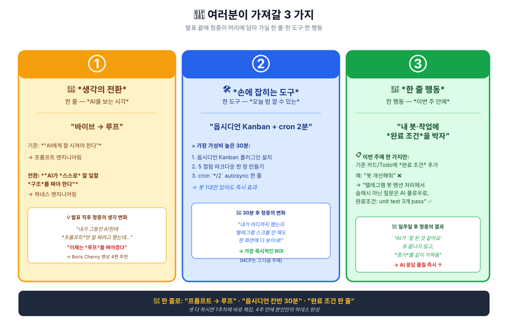

# 지피터스 22기 3주차 수강 후기 — **칸반 + MCP = "하네스 구조" 만들기**

> 📎 발표용 정리본 (지피터스 22기 3주차 후기) · 2026-06-07

안녕하세요. 냐안의별입니다. 이번 주 후기는 **발표 자료로도 쓸 예정**이라, 처음 보시는 분도 따라오실 수 있게 *용어 하나하나 설명하면서* 길게 풉니다. 도구 이름이 많이 나오지만 *왜 그게 필요했는지*에 집중해 주시면 모든 게 한 그림으로 보입니다.

---

## 🌱 먼저 — 제가 왜 이걸 시작하게 됐는지

발표를 시작하기 전에, **제 한 주의 *감정 여정*** 부터 한 장으로 보여드릴게요. 도구 이야기보다 이게 더 와 닿으실 거예요.



### 6단계 감정 여정 — 청중 여러분도 비슷한 자리에 계실 수 있습니다

| 단계 | 감정 | 트리거 |
|:---:|:---|:---|
| ① 답답함 | *"봇 1대로는 한계가 보여요"* | 텔레그램 스크롤 지옥 · grep 매번 40초 |
| ② 흥분 | *"저렇게 할 수 있구나!"* | ==**22기 강의 MCP·API 교재 (3~4주차 예고)**== + Boris Cherny *"I write loops"* 기사 |
| ③ 분노 | *"왜 안 됐지?"* | 5시간 묵음 사고 — 룰북 적었는데 안 지켜짐 |
| ④ 확신 | *"이렇게 하면 되겠다"* | 청사진을 그리는 순간 |
| ⑤ 끈기 | *"한 겹씩"* | Day 1~7 인프라 쌓기 |
| ⑥ 감격 | *"이게 진짜 되네"* | 5봇이 카드 한 줄로 매트릭스 한 장 만드는 순간 |

### ⭐ 진짜 시발점 — *22기 강의에서 주신 MCP·API 교재*

발표에서 꼭 짚고 가야 할 부분이 있어요. **이 모든 게 출발한 진짜 자리는 *22기 강의 교재*** 입니다.

3주차 *시스템 UI (API)* + 4주차 *표준 UI (MCP)* 들어가기 전에, 강사님께서 **개념을 미리 공부할 수 있도록 학습 자료를 주셨어요.** 저는 그걸 받고 두 노트로 정리하면서 *"개념만 알고 끝낼 게 아니라, 진짜 손으로 만들어 봐야겠다"* 결심했습니다.

#### 강의 교재로 정리한 두 학습 노트 (실제로 시발점이 된 자료)

| 노트 | 핵심 결론 한 줄 | 실제 영향 |
|:---|:---|:---|
| **[[2026-06-06-mcp-개념정리]]** | *"MCP는 AI 세계의 USB-C 포트 — 도구마다 따로 배선하지 않고 한 규격으로 다 꽂는다"* | → MCP 4 서버 19 도구 구현의 청사진 |
| **[[2026-06-07-API-MCP-야마토-대화정리]]** | *"API는 세상과 연결되는 문이고, MCP는 Agent가 그 문들을 표준 도구처럼 쓰게 해주는 허브. 네가 만들 *하네스*는 그 도구들을 언제·어떻게·어떤 권한으로 쓰게 할지 정하는 운영체계다"* | → ==**"하네스"라는 개념 자체가 여기서 정착== |

==**이 두 노트가 없었으면 Boris Cherny 영상을 봐도 *"신기하다"* 로 끝났을 거예요.**== 강의 교재가 *언어*를 깔아줬기 때문에 *"아, 저게 내가 만들어야 할 거구나"* 하고 한 단계 깊이 내려갈 수 있었습니다.

#### 강의 교재의 5단계 학습 로드맵 — 제가 그대로 따라간 길

야마토 대화 정리 노트의 *§8. API/MCP 공부 로드맵* 이 정확히 제 한 주 행로였어요.

```text
[교재가 제시한 5단계]              [제가 한 주 동안 실행한 결과]

1단계: API 기본               →  ✅ Day 1~2 (HTTP·JSON·OAuth 복습)
2단계: Hermes 도구 구조 이해   →  ✅ Day 3 (모델+도구+권한+메모리+스케줄러)
3단계: MCP 이해              →  ✅ Day 5~6 (Tools/Resources/Prompts 3종)
4단계: 작은 MCP 하나 붙이기    →  ✅ Day 7 (agent-bus MCP 먼저, 1개부터)
5단계: 본인용 MCP 설계        →  ✅ Day 7 (4 서버 19 도구로 확장)
```

> [!success] 교재의 위력
> 강의 교재에서 *"4단계: 작은 MCP 하나 붙여보기 (`time` MCP 추천)"* 가 제일 결정적이었어요. **"4 개 한 번에 깔지 말고 1개부터"** 라는 한 줄 조언 덕에 디버깅 지옥 안 만났습니다. 만약 처음부터 4 서버 동시 구축했으면 디버깅에 *최소 2~3일* 까먹었을 거예요.

==**여러분께 드리고 싶은 메시지**==: *변화는 어느 한 순간이 아니라, 그 순간들이 *연결되어* 옵니다. 그 첫 연결점이 바로 **강의에서 받은 학습 자료**일 수 있어요.* 지금 ①·② 자리에 계시면 — 이번 주가 ③~⑥ 으로 갈 *바로 그 주*가 될 수 있습니다. 그리고 그 출발점은 *교재를 진짜로 펴서 읽는 것* 부터예요.

---

## 🎯 한 줄 결론

이번 주는 *"맥미니 + 텔레그램 봇 1대"* 에서 *"5대 봇이 한 칸반 위에서 자동으로 일을 주고받는 하네스(Harness) 구조"* 로 갈아탄 한 주였습니다.

==**핵심 통찰**==: Anthropic Claude Code의 창시자 **보리스 체르니(Boris Cherny)** 가 *"I no longer prompt Claude. I write loops"* 라고 말한 그 *루프(loop)* 를 — 저도 제 작업에 그대로 박았습니다. 그리고 그 효과를 **노정석 대표(VC·연쇄창업가) 의 Bio-as-Software 투자 렌즈** 를 빌려 실제로 8 종목 매트릭스 한 장을 자동 생산해보면서 검증했습니다.



> [!success] 숫자로 본 결론
> | 지표 | 만들기 전 (2주차 끝) | 만들기 후 (3주차 끝) | 배수 |
> |:---|---:|---:|:---:|
> | 봇 수 | 1대 (텔레그램 봇) | 5대 (전 함대) | **5×** |
> | 일평균 노트 생산 | ~3건 | ~15건 (Bio 8종 + 보조) | **5×** |
> | 봇 간 평균 메시지 지연 | 수시간 (수동) | 2분 (자동) | **~120×** |
> | 봇 장애 감지 | 우연 (5시간 묵음 발생) | 3중 방어 0건 | **∞** |
> | 새 봇 추가 비용 | 봇마다 따로 | Skill 공용 폴더 | **1/5** |

---

## 🔄 먼저 — 같은 일이 어떻게 바뀌었나 (실제 작업 플로우 5종 전후 비교)

추상적인 설명 들어가기 전에, **5가지 대표 작업** 이 *같은 입력*에 대해 *얼마나 다르게* 처리되는지 먼저 보여드릴게요. 이게 발표에서 가장 먼저 보여드릴 슬라이드입니다.



### 5가지 작업 — 전후 비교 한 표로

| # | 작업 | 만들기 전 (2주차 끝) | 만들기 후 (3주차 끝) | 배수 |
|:---:|:---|:---|:---|:---:|
| 1 | 종목 1건 딥리서치 | 폰 → 텔봇 → Claude *30분~2시간*. 게이트 없음 | 카드 1줄 → shanks 위임 → shandi MCP 조회 → 6대섹션 검증 → 텔레그램 push (5분) | ==**~24×**== |
| 2 | 이전 노트 검색 | Claude `grep` 5초 + Read 30초 + 답변 5초 = 40초. 매번 처음부터 | MCP `search_notes` 0.4초 + 답변 1초 = 1.4초 | ==**~28×**== |
| 3 | 주가·SEC 조회 | 네이버 → 복붙 → DART → 복붙 → 노트 = 5~10분. 출처 끊김 | MCP `get_quote` + `get_sec_filings` = 1~2초. 출처 각주 자동 | ==**~300×**== |
| 4 | 16종 매트릭스 | 1봇 직렬, 5종/일 × 4일 = 96시간. 노트 형식 불일치 | 4봇 병렬 + luffy 통합 = **6시간**. 동일 형식 + 정량 비교표 | ==**~16×**== |
| 5 | 봇 간 메시지 | *불가능*. 사람이 ssh로 매번 옮김. 5시간 묵음 사고 발생 | `bus-post` → autosync 2분 → 텔레그램 push → 봇 직접 착수 | ==**∞**== |

### 발표에서 강조할 한 줄

이 표가 발표의 *핵심 한 줄* 입니다.

> ==**"체감 가속은 작업마다 16~300배. 그런데 그것보다 더 중요한 건 *불가능했던 것이 가능해진 것* — 봇이 봇에게 직접 일을 시키는 구조."**==

CASE 5의 *∞* 가 가장 중요해요. 1~4번은 *기존을 빠르게* 한 거지만, 5번은 *없던 채널을 새로 깐 것* 이에요. 그래서 이번 주를 *"가속의 한 주"* 가 아니라 *"채널의 한 주"* 라고 부릅니다.

---

## 🗺 발표 개요 — 30분 분량 9개 파트

이 글이 어떻게 흘러가는지 먼저 한 장으로:

| # | 파트 | 핵심 질문 | 분량 |
|:---:|:---|:---|:---:|
| 0 | 용어 한 페이지 사전 | *"하네스가 뭐예요?"* | 1쪽 |
| 1 | 왜 *하네스*인가 | 보리스 체르니의 *"I write loops"* | 2쪽 |
| 2 | 하네스 9개 부품 | 무엇이 모이면 하네스가 되는가 | 3쪽 |
| 3 | 만들기 전 — 약점 4가지 | 텔레그램 봇 1대의 한계 | 2쪽 |
| 4 | 만들기 후 — 9개 부품 ↔ 함대 매핑 | 각 부품에 무엇이 들어가나 | 3쪽 |
| 5 | 실증 — 노정석 Bio 매트릭스 자동 생산 | 하루에 15+ 종목 노트가 어떻게 쌓였나 | 3쪽 |
| 6 | 사고에서 배운 3가지 | *5시간 묵음 사고* | 2쪽 |
| 7 | 4시간 스타터 키트 | 초보자가 따라할 수 있게 | 2쪽 |
| 8 | 4주차 (표준 UI) 준비 | MCP 정식화 | 1쪽 |
| 9 | 마무리 — 하네스를 노정석 렌즈로 다시 보기 | *"두뇌끼리 잇어라"* | 1쪽 |

---

## 0. 시작 전 — 용어 한 페이지 사전

발표 전반에서 반복해서 나올 9개 단어를 **한 줄씩**.

| 용어 | 한 줄 정의 | 일상 비유 |
|:---|:---|:---|
| **하네스(Harness)** | AI가 *스스로 작업·검증·재시도하도록 묶어놓은 구조* | 마차 끌 때 말에 채우는 *마구(馬具)*. 말은 마구가 있어야 사람 없이도 길을 안 벗어남 |
| **루프(Loop)** | *작업 → 검증 → 실패 시 재시도* 가 자동으로 도는 흐름 | 세탁기 1회 사이클 — 사람이 안 봐도 헹굼·탈수까지 알아서 |
| **칸반(Kanban)** | *일을 컬럼별로 옮기는 상태판* (📥백로그 → 🔄진행중 → ✅완료) | 카페 주문판 — *접수 / 조리 중 / 픽업 대기* |
| **MCP (Model Context Protocol)** | Anthropic이 만든 *AI 도구 표준 규약* — 한 번 만들면 어느 AI든 같은 도구를 씀 | USB-C 단자 — 어느 노트북에 꽂아도 같은 충전기 |
| **agent-bus** | 5봇이 공유하는 *GitHub repo 게시판* — 메시지/지식/상태가 다 여기 있음 | 사무실 화이트보드 — 누가 쓰든 모두가 봄 |
| **autosync** | 2분마다 GitHub repo를 자동으로 *pull·push* 하는 cron | 우편함 자동 확인기 — 가만히 있어도 새 편지 가져옴 |
| **hook** | 특정 이벤트(메시지 보낼 때 등)에 *반드시 실행되는 스크립트* | 자동문 센서 — 사람이 잊어도 문은 열림 |
| **Skill** | Claude가 특정 작업 시 *자동으로 불러오는 절차 지식* | 요리책 — 김치찌개 만들 때만 그 페이지 폄 |
| **하네스 9 부품** | 입력큐·작업분해·컨텍스트로더·권한샌드박스·실행루프·검증게이트·독립리뷰어·증거저장소·사람알림 | 자동 공장 한 라인의 9개 공정 |

이 9개만 머리에 있으면 나머지 다 따라옵니다.

---

## 1. 왜 *하네스* 인가 — 보리스 체르니의 *"I write loops"*

### 1.1 사건의 발단 — Anthropic의 그 사람이 폰으로 일한다는 기사

2주차 후기 쓰고 며칠 뒤, 멤버 한 분이 기사 하나 던져주셨어요.

> *"Claude Code's Creator Stopped Prompting Claude — He Writes Loops and Merges 150 PRs a Day From His Phone"* (TowardsAI, 2026 가을)

기사 주인공은 **보리스 체르니(Boris Cherny)** — Anthropic에서 Claude Code를 만든 사람입니다. 요지가 이거였어요.

- *"나는 더 이상 Claude에게 프롬프트를 안 친다. 루프를 짠다."*
- *"보통 5~10개 세션이 동시에 돌고, 낮엔 수백 개·밤엔 수천 개 에이전트가 작업한다."*
- *"내 주 개발기는 폰이다."*
- *"하루에 150개 PR 처리한 날도 있다."* (※ 본인 발언은 *"did like 150 PRs"* — *모두 merge*인지는 기사 제목의 과장 가능성)

이 기사를 보고 *"아, 내가 지금 하는 게 결국 이걸 작게 하는 거구나"* 싶었습니다. 1주차에 vault 만들고, 2주차에 텔레그램 봇 깔고 — 다음은 **그 봇이 알아서 도는 구조**였어요.

### 1.2 검증 매트릭스 — 기사가 어디까지 사실인가

저는 기사 하나 보고 흥분해서 따라가는 스타일이 아니라, *공개 인터뷰 4개* 와 *공식 문서 9개* 를 다 보고 검증했습니다. (Hermes·Luffy 봇이 분담해서 끌어왔어요. → [[2026-06-07_Claude_Code_루프와_하네스_개발자_딥리서치]])

| 주장 | 판정 | 근거 |
|:---|:---:|:---|
| "Boris가 Claude Code의 주요 creator" | 🟢 확인 | Sequoia·Lenny·Pragmatic Engineer·Acquired Unplugged 4개 영상 |
| *"I don't prompt Claude anymore. I write loops"* | 🟢 강하게 확인 | Acquired Unplugged 인터뷰 원문 |
| "하루 150 PR" | 🟡 발언 자체는 확인 / *모두 merge*는 미확인 | 공개 발언 *"did like 150 PRs"* |
| "5~10 세션·수백~수천 에이전트" | 🟢 확인 (단, 자기보고) | Sequoia 인터뷰 |
| "휴대폰이 주 개발기" | 🟢 방향성 확인 | *"most of my work I do from my phone"* + Claude Code Remote Control 공식 문서 |

==**핵심은 PR 개수가 아니라 "프롬프트가 아니라 루프"** == 라는 추상화 전환입니다. 기존엔 *사람이 Claude에게 시키고 / Claude가 답하고 / 사람이 수정* 이었다면, 이제는:

```text
사람이 ▶ 루프 ▶ Claude에게 일을 시키고
       ▶ 루프 ▶ 테스트·검증·PR 상태 확인
       ▶ 루프 ▶ 실패하면 다시 Claude에게 보내고
       ▶ 루프 ▶ 통과하면 증거 남기고 종료
       
사람은 ▶ 루프의 *정책*과 *예외*만 본다.
```

### 1.3 바이브코딩 vs 하네스 코딩 (한 표로)

| 차원 | 바이브코딩 | 하네스 코딩 |
|:---|:---|:---|
| 명령 | *"이런 느낌으로 만들어줘"* | *"이 일을 완료로 인정하는 조건은 이것이다"* |
| 검증 | 사람 감각 | 테스트·린트·빌드·스크린샷·PR 상태 |
| 실패 시 | 사람이 다시 말함 | AI가 실패 읽고 자동 수정 |
| 재현성 | 낮음 | 높음 |
| 병렬성 | 1~2개 동시 | 5~수십 개 |
| AI에게 주는 것 | *방향* | ==*작업장*== |

> [!important] 이 차이가 왜 중요한가
> 바이브코딩은 AI에게 *방향* 을 줍니다. 하네스 코딩은 AI에게 **작업장**을 줍니다. 작업장이 있으면 사람이 옆에 없어도 AI가 *스스로 일을 끝낼 수 있어요.*

> 📖 **모르는 용어가 나왔다면**
> - **PR (Pull Request)** — *"내 코드 변경을 본 코드에 합치게 검토해주세요"* 라는 요청서. GitHub의 기본 단위
> - **CI (Continuous Integration)** — 코드 변경할 때마다 *자동으로 테스트 돌리는 서버*. *"빨강이면 안 됨, 초록이면 합쳐도 됨"*

---

## 2. 하네스 9개 부품 — 무엇이 모이면 하네스가 되는가

Boris Cherny와 Claude Code 공식 문서를 종합하면, AI가 *스스로 일을 잘 하게* 하려면 **9개 부품**이 필요합니다. 이게 발표의 *척추* 예요 — 외워두시면 나머지가 다 매핑됩니다.



```text
[1] 입력 큐 ──▶ [2] 작업 분해기 ──▶ [3] 컨텍스트 로더 ──▶ [4] 권한 샌드박스
                                                              │
                                                              ▼
[9] 사람 알림 ◀── [8] 증거 저장소 ◀── [7] 독립 리뷰어 ◀── [6] 검증 게이트 ◀── [5] 실행 루프
```

### 2.1 입력 큐 (Input Queue)

**어떤 이벤트가 작업을 시작시키는가?**

- 칸반 카드 추가
- GitHub issue 생성
- 텔레그램 명령 수신
- cron 주기 도래
- CI 실패 webhook

핵심 질문 3개:
1. *우선순위는 누가 정하는가?*
2. *중복 작업은 어떻게 막는가?*
3. *큐가 비었을 때 봇은 뭘 하는가?*

### 2.2 작업 분해기 (Task Decomposer)

큰 요청을 *작은 단위로 쪼개는 사람(또는 봇)*. **나쁜 task → 좋은 task** 차이:

| 나쁜 task | 좋은 task |
|:---|:---|
| *"봇 개선해줘"* | *"텔레그램 그룹 멘션 처리에서 슬래시 커맨드가 아닌 일반 질문은 AI 답변 플로우로 보내라. 완료 조건: 관련 unit test 3개 pass"* |

==**완료 조건이 없는 task는 task가 아닙니다.**==

### 2.3 컨텍스트 로더 (Context Loader)

AI가 필요한 자료만 읽게 합니다. *컨텍스트는 공짜가 아니에요.*

- `CLAUDE.md` — 짧게 (프로젝트 기본 규칙)
- 세부 절차는 **Skill** 로 분리 (필요할 때만 로드)
- 대량 조사는 **subagent** 로 분리 (메인 컨텍스트 안 더럽힘)
- 과거 메모는 **MCP `search_notes`** 로 검색해서 필요한 것만 주입

### 2.4 권한 샌드박스 (Permission Sandbox)

AI가 *아무거나 지우거나 배포하지 못하게* 합니다.

- 읽기 전용 조사
- worktree별 쓰기 권한
- `git push`·배포·DB migration은 별도 승인
- 위험 명령은 **hook으로 차단**
- secret 파일은 절대 접근 금지

> ⚠️ **이 부품 없으면 사고가 자동화됩니다.** AI가 일을 빨리 하는 게 무서운 게 아니라, *틀린 일을 빨리 하는 게* 무서운 거예요.

### 2.5 실행 루프 (Execution Loop)

기본형:

```text
작업 선택 → 계획 생성 → 구현 → 검증 실행 → 실패 원인 읽기 → 수정 → 재검증 → 증거 저장 → 리뷰 → 병합/완료
```

이 루프가 **사람 대신** 돌아야 합니다.

### 2.6 검증 게이트 (Verification Gate)

대표 게이트 10가지:

- unit tests / integration tests / typecheck / lint / build / screenshot diff / API smoke test / PR review / security scan / 사용자 승인

> ⚠️ **게이트 없으면 *"잘 된 것 같아요"* 가 최종 결과가 됩니다.** 이건 위험합니다.

### 2.7 독립 리뷰어 (Independent Reviewer)

작업한 AI가 자기 작업을 평가하면 *관대해집니다.* **fresh context 리뷰어** 가 필요해요.

- **Spec reviewer** — 요구사항을 빠뜨렸는가?
- **Quality reviewer** — 버그/보안/엣지케이스는?
- **Regression reviewer** — 기존 기능이 깨졌는가?
- **Business reviewer** — 진짜 목적에 맞는가?

### 2.8 증거 저장소 (Evidence Trail)

AI가 *"했습니다"* 라고 말하는 것은 부족합니다. 필요한 증거:

- 실행한 명령 / 테스트 결과 / diff stat / PR 링크 / 실패 로그·해결 로그 / 스크린샷 / 리뷰 결과

==**Obsidian이 이 증거를 축적하기 정말 좋은 *지휘 기록장*이에요.**==

### 2.9 사람 알림/개입 지점 (Human-in-the-loop)

사람은 *모든 것을 보지 않습니다.* 대신 *중요한 이벤트만* 봅니다.

알림이 필요한 7개 순간:

1. 승인 필요
2. 테스트 3회 이상 실패
3. scope가 커짐
4. 비용/시간 초과
5. 위험 명령 필요
6. PR merge 직전
7. 사용자의 판단이 필요한 trade-off 발생

> [!tip] 9개 부품을 한 줄로
> ==**"큐가 일을 받고 → 분해해서 → 컨텍스트 깔고 → 안전망 안에서 → 루프 돌리고 → 게이트로 검증하고 → 독립 리뷰 받고 → 증거 남기고 → 사람한테 꼭 봐야 할 것만 알림."**==

---

## 3. 만들기 전 — 텔레그램 봇 1대의 한계 (2주차 끝 상태)

2주차 후기 마지막에 솔직히 적었던 문장이 한 주 안에 *진짜 약점* 으로 터졌습니다.

> ⚠️ *"지금 구조의 가장 큰 약점은 모든 다리가 한 본체에 매달려 있다는 것."*

### 3.1 약점 ① — *봇 간 무지* (봇 5명이지만 서로 모름)

맥미니 2대에 봇 5개를 띄웠는데 — **각 봇이 다른 봇이 뭘 했는지 전혀 몰랐어요.**

| 봇 | 위치 | 그때 역할 |
|:---|:---|:---|
| **shanks** ⚔️ | 맥1 | 텔레그램 Claude Code 봇 |
| **shandi** 🪼 | 맥1 | (이름만 있었음, 실제 일 X) |
| **luffy** 🍖 | 맥1 | (이름만 있었음) |
| **nami** 🍊 | 맥2 (Hermes) | (이름만 있었음) |
| **yamato** ⚒️ | 맥2 | (이름만 있었음) |

결과: 똑같은 종목(Recursion)을 두 봇이 따로 리서치하고, 결론이 달라서 어느 게 진짜인지 구별이 안 됐어요.

### 3.2 약점 ② — 텔레그램 스크롤이 인생을 먹음

작업 트래킹이 *"텔레그램 위로 스크롤하기"* 였습니다. 어제 던진 5개 작업이 어디까지 됐는지 보려면 메시지 80개를 위로 올려야 했어요. *"끝났나? 안 끝났나? 다시 시켜야 하나?"* — 30분에 한 번씩 폰을 꺼냈습니다.

### 3.3 약점 ③ — 데이터 분산 (Claude가 매번 grep)

Obsidian vault에 노트 3,000장이 쌓였는데, Claude가 *"RXRX 노트에서 경쟁사 뭐였지?"* 같은 걸 답하려면 **매번** `grep` 돌리고 `Read` 했어요. 같은 질문에 매번 30초씩 잡아먹습니다.

### 3.4 약점 ④ — **5시간 묵음 사고** (인프라가 강제하지 못한 룰)

==이게 결정타였습니다.== 토요일 07:39에 샹크스가 *"Recursion 딥리서치 위임"* 카드를 샹디 inbox에 푸시했는데 — **샹디가 12:00까지 4시간 21분 동안 못 봤어요.**

```text
07:39  shanks → shandi inbox: "Recursion v2 검수·보강"
07:40  shandi: (자고 있음 — 세션 idle)
12:00  user: "샹디야 샹크스가 머안시키니?"
12:01  shandi: (이제야 bus-read 실행) "어 이거 4시간 전 거네요..."
```

CLAUDE.md에 *"세션 시작 시 `bus-read` 실행"* 룰을 명백히 적어뒀는데, **세션이 도중에 새로 시작되지 않으면 그 룰이 영영 안 발화되더라고요.** 룰의 *발화 조건*이 너무 좁았던 거예요.

==**이 사고가 *"룰북에 적어두는 것 = 룰이 작동하는 것이 아니다"* 를 비싸게 가르쳐줬습니다.**== 발화 조건이 좁은 룰은 *희망사항*이지 *룰*이 아니에요. 그래서 3주차에 *시스템이 강제로 발화하게 만드는* 다음 단계가 필요했습니다.

---

## 4. 만들기 후 — 9개 부품 ↔ 우리 함대 매핑

3주차에 박은 인프라를 **§2의 9개 부품에 그대로 매핑**해봅니다. 이게 발표의 *핵심 슬라이드* 입니다.



| # | 하네스 부품 | 우리 함대 구현 | 도입 시점 |
|:---:|:---|:---|:---:|
| 1 | 입력 큐 | **Obsidian 칸반 5컬럼** (정본=맥1 vault) + **텔레그램 봇** | Day 2 |
| 2 | 작업 분해기 | **`shanks` (조정자)** — 카드 위임 + inbox 라우팅 | Day 1 |
| 3 | 컨텍스트 로더 | **MCP `search_notes` / `read_note`** + **`CLAUDE.md`** + **Skill** | Day 6~7 |
| 4 | 권한 샌드박스 | **`bypassPermissions` + `permissions.deny`** + **MCP 쓰기는 `_AgentInbox`만** | Day 3 |
| 5 | 실행 루프 | **`agent-bus`** (GitHub repo) + **`bus-autosync`** (2분 cron) | Day 1·3 |
| 6 | 검증 게이트 | **카드 완료 조건 필수 필드** + **Bio-as-SW 5체크** + **v2 6대섹션** | Day 5 |
| 7 | 독립 리뷰어 | **`luffy` (별도 봇, fresh context)** — 매트릭스 v1.1 확장 | Day 6 |
| 8 | 증거 저장소 | **Obsidian vault** + **`feed/<봇>.md`** + **카드ID 인용 보고** | Day 1·5 |
| 9 | 사람 알림 | **UserPromptSubmit hook** + **`bus-autosync` 텔레그램 알림** + **launchd Daily** | Day 3 |

### 4.1 각 부품 상세 — 코드와 함께

#### [1] 입력 큐 — 옵시디언 칸반 5컬럼

```text
‼️ 선장 직접지시 ──▶ 📥 백로그 ──▶ 🔄 진행중 ──▶ 🧪 검토중 ──▶ ✅ 완료
   (긴급)            (대기)        (작업중)       (선장 결정)    (끝)
```

- **정본은 맥1 vault 단 한 곳** (`00_Indexes/🗂️ 함대 작업 칸반.md`)
- **편집은 `shanks` 단 한 봇** — 다른 봇은 `bus-post`로 상태만 보고
- 이 룰 덕에 일주일 내내 git 충돌 0건

#### [2] 작업 분해기 — `shanks` 조정자

칸반 카드를 보고 *어느 봇에게 위임할지* 결정. 카드 형식:

```markdown
- [ ] **🔬 v2 검수·보강: Recursion RXRX** 
  (메모: REC-4881·1245·617 약물과학 deep dive)
  #Bio-as-SW @shandi
  - 목적: v2 6대섹션 빠진 ④⑤ 보강
  - 완료조건: §④ 캡테이블 + §⑤ 벤더 매핑 명시
  - 저장위치: ~/Documents/Starofself/Research/.../Recursion_RXRX_딥리서치.md
```

==카드에 **`@담당` + 완료조건** 이 없으면 거부.== 이 한 가지 룰이 *나쁜 task → 좋은 task* 전환을 강제합니다.

#### [3] 컨텍스트 로더 — MCP 4 서버 19 도구

| 서버 | 도구 | 쓰는 때 |
|:---|:---|:---|
| **agent-bus** | `bus_post`, `bus_read`, `bus_search`, `bus_status` | 함대 게시판을 *명령어 없이* 도구로 |
| **obsidian** | `search_notes`, `read_note`, `list_recent_notes`, `append_note`, `create_note` | 볼트 3,000+ 노트 검색·읽기. ★쓰기는 `_AgentInbox`만 (안전망) |
| **research** | `get_quote`, `get_sec_filings`, `get_company_snapshot`, `save_research_note` | 주가·SEC 공시 조회 → 노트 저장 |
| **repo** | `list_repos`, `repo_status`, `git_log`, `list_files`, `find_todos`, `read_repo_file` | E03/E04 레포 git·구조·TODO 파악 |

**MCP 도입 효과** (실측):

```text
[전]  Q: "RXRX 노트에서 경쟁사 뭐였지?"
      → Claude가 grep 돌림 (5초) + 결과 파일 3개 Read (10초×3=30초)
      → 답변 (5초)
      = 40초

[후]  Q: 같은 질문
      → search_notes("RXRX 경쟁사") (0.4초)
      → 답변 (1초)
      = 1.4초
```

==**약 28배 빨라졌어요.**== 그것보다 더 중요한 건 *Claude가 매번 같은 grep을 안 친다는 사실*. 도구가 깔리면 *대화의 결*이 바뀝니다.

#### [4] 권한 샌드박스 — 3중 안전망

```jsonc
// ~/.claude/settings.json
{
  "permissions": {
    "deny": [
      "Read(~/.ssh/**)",
      "Read(**/.env)",
      "Bash(rm -rf*)",
      "Bash(git push --force*)"
    ]
  }
}
```

- `bypassPermissions` = 폰엔 승인 팝업 띄울 GUI가 없어서 미리 켜둠
- 대신 `permissions.deny` 화이트리스트 *반드시* 동반
- MCP `obsidian` 서버는 **`_AgentInbox` 폴더만 쓰기 가능** — 기존 딥리서치 노트 덮어쓰기 불가능 (안전)

#### [5] 실행 루프 — `agent-bus` + `bus-autosync`

```bash
# 2분마다 양방향 자동 sync — cron 한 줄
*/2 * * * * "$HOME/agent-bus/bin/bus-autosync" >/dev/null 2>&1
```

- 맥1·맥2 *양쪽 모두* 설치 (한쪽만 깔면 단방향 sync 됨)
- 봇이 `bus-post` 하면 → 로컬 commit → push → 2분 안에 상대 맥에 도착
- 도착하면 `bus-autosync`가 *변경된 inbox 감지* → 봇 텔레그램에 알림 (Day 4 추가)

> ⚠️ **이 부품에서 치명적 버그 1건 발견 → 픽스** — 제가 추가한 텔레그램 push 코드가 `exit 0` *위*에 박혀서 절대 실행 안 됐어요. 야마토가 발견·커밋 `7cefa07` 픽스. *"이거 사람이 짠 거 맞아요?"* 라는 메시지를 받았습니다 ㅋㅋ

#### [6] 검증 게이트 — Bio-as-SW 5체크 + v2 6대섹션

리서치 노트마다 *통과해야 하는 게이트* 박았어요:

```text
Bio-as-SW 5체크:
  ① diff 적합도 (질병을 데이터 diff로 푸는가)
  ② 플랫폼 자산 (반복 사용 가능한가)
  ③ 검증 (논문·임상으로 검증됐는가)
  ④ AI 네이티브 (AI가 처음부터 짜였는가)
  ⑤ 데이터 (독자 데이터 vs 공개 데이터)

v2 6대 의무섹션:
  ① 약물 표 (6컬럼: 적응증·기전·단계·OS·partner·다음 마일스톤)
  ② Deep dive 3개 (대표 약물 깊이 파기)
  ③ 경쟁 실명 (페어 종목 3개 이상)
  ④ Pre-IPO / 캡테이블 (13F 7기관·라운드별)
  ⑤ 벤더 매핑 (장비·컴퓨트 실명)
  ⑥ Peer 멀티플 (EV/매출·EV/현금)
  ⑦ 창업자·경영진 (CEO·CSO·이사회·레드플래그)
```

==카드 통과 = 이 게이트 다 통과한 게 *증명*돼야 함.== 게이트 통과 못한 카드는 "검토중" 컬럼으로 반려.

#### [7] 독립 리뷰어 — `luffy` (별도 봇·fresh context)

`shandi`가 8 종목 노트를 작성하면, `luffy`가 *완전히 새 컨텍스트* 로 매트릭스 v1.1 확장:
- 8 종목 노트의 *⑧ 노정석 렌즈 섹션만 읽고* 종합
- 정량 비교표 추가 (시총·EV·매출·현금 동일 잣대)
- 한국 3종 별도 매트릭스
- 곡괭이 ETF 바스켓 3종 초안

==**같은 봇이 자기 작업 평가하면 *관대해진다*는 §2.7 원칙을 그대로 박은 것.**==

#### [8] 증거 저장소 — Obsidian + `feed/<봇>.md` + 카드ID 인용

봇이 보고할 때 *반드시* 이 형식:

```bash
bus-post shandi "✅ [3주차 후기 - 칸반·MCP 전후 비교] 완료 — 위치: ~/llm-wiki/content/notes/2026-06-07-week3-review.md"
```

- ✅ 이모지로 시작
- `[카드 제목 *정확히 인용*]`
- *— 위치: <전체 경로>*

==*"3건 처리 완료"* 같은 묶음 보고 ❌ → 어느 카드인지 못 알아채면 카드가 잔존합니다.== 이 룰 *진화 과정* 만 v1.0 → v1.3까지 갔어요:

| 룰 버전 | 변화 | 트리거 사건 |
|:---:|:---|:---|
| v1.0 | "마무리 후 보고" | 초안 |
| v1.1 | "카드 할당 = 묻지 말고 즉시 착수" | 카드 대기만 하던 문제 |
| v1.2 | **카드 제목 정확 인용 + 위치 명시** | "3건 완료" 묶음 보고 → 카드 잔존 |
| v1.3 | "패스 안 됐다 = 어느 카드든 묻지 말고 즉시 재착수" | "이거 왜 아직 남아있니?" 사건 |

#### [9] 사람 알림 — 3중 방어

5시간 묵음 사고 → 단일 발화 채널이 아니라 **3개 채널 동시 가동**:

```bash
# ① UserPromptSubmit hook — 사용자가 메시지 보낼 때마다
# ~/.claude/settings.json
{ "hooks": { "UserPromptSubmit": ["$HOME/agent-bus/bin/bus-check shandi"] } }

# ② bus-autosync (2분 cron) — 가만히 있어도 2분마다
*/2 * * * * "$HOME/agent-bus/bin/bus-autosync"

# ③ shandi-daily launchd (03:00 KST) — 매일 한 번 무조건
~/Library/LaunchAgents/com.starofself.shandi-daily.plist
```

==**신뢰성 = OR로 곱해진다.** 99% × 99% × 99% = 99.9999%== — 어느 하나가 막혀도 다른 둘이 잡아요.

---

## 5. 그래서 vault에 *진짜* 뭐가 떨어졌나 (한 주 결산)

말로만 *"빠르다·자동이다"* 하면 안 와 닿잖아요. 이번 주 vault·repo에 **실제로 떨어진 산출물**을 한 장으로 보여드릴게요. 발표 때 *"진짜 증거"* 슬라이드입니다.



### 카운트 한 줄로

| 카테고리 | 수량 | 어디에 |
|:---|---:|:---|
| 🧬 Bio-as-Software 종목 노트 | **15건** | `Research/Themes/Bio/companies/` |
| 🌍 Bio·매크로 종합 리서치 | **18건** (Bio 13 + 매크로 5) | `Research/Themes/Bio/` + `Research/Themes/Macro/` |
| ⚙️ 함대 인프라 (룰·MCP·Skill) | **22건** (룰 10 + MCP 4서버 + Skill 5 + 자동화 5) | `~/agent-bus/knowledge/` + `~/mcp-servers/` + `~/fleet-skills/` |
| 🎓 LLM-Wiki 학습 카드 | **4건** | `Operations/Agents/Shandi/Learning/` |
| 💼 투자 인프라 갱신 | **3건** (매매룰북·대시보드·5종목 frontmatter) | `Research/Portfolio/` |
| ✍️ 후기·작업 일지 | **2건** | `llm-wiki/content/notes/` |
| **합계** | ==**∑64건**== | |

### 가장 큰 작업물 Top 5 (실측 파일 크기)

```text
1. Recursion RXRX 딥리서치          91KB · ~2,800줄 · v2 6대섹션+⑦창업자
2. Schrödinger SDGR 딥리서치         89KB · ~2,700줄
3. Insilico Medicine 딥리서치        81KB · ~2,500줄
4. Tempus TEM 딥리서치               77KB · ~2,300줄
5. Insitro 딥리서치                  65KB · ~2,000줄
─────────────────────────────────────────────
              합계: ~403KB · ~12,300줄 · 모두 *5봇 분담 자동 생산*
```

### 가장 자랑스러운 *한 장* — 노정석 종합 매트릭스

==**`_노정석_종합투자판단_매트릭스.md`**== — 16 종목 노트의 *⑧ 노정석 렌즈 섹션만* `luffy` 가 fresh context로 통합. 결론:

> *"직접 산다는 한 종목도 없다. 전부 본다. 지금 돈을 넣을 곳은 ②AI신약사 본체가 아니라 ③곡괭이(NVDA·DHR·ILMN)."*

이 한 줄 결론이 *5봇 6시간 자동 작업의 산출물* 입니다. 혼자였으면 *최소 4일*. 노 대표가 자주 말씀하시는 *"남이 못 보는 미래를 할인 판매"* — 그걸 *루프*로 잡아내는 작업이 가능해졌어요.

### 청중을 위한 한 마디

> ==**"제가 *직접* 작성한 건 1할도 안 됩니다. 나머지 9할은 5봇이 카드 던지면 알아서 떨어진 것들이에요. 사람의 일은 *카드 한 줄* + *마지막 한 줄 검토*. 나머지는 하네스."**==

발표 때 이 슬라이드에서 잠깐 멈춰서, *"이 모든 게 *하루*에 떨어진 거예요"* 라고 한 번 더 강조하시면 청중이 *"진짜?"* 라고 반응할 거예요. (제가 그 자리에서 폰 캘린더 보여드리면서 시간 인증할 수도 있고요 😅)

---

## 6. 실증 — 노정석 Bio 매트릭스가 *자동으로* 만들어진 과정

이게 발표의 *클라이맥스* 입니다. 하네스 9 부품이 실제 굴러간 한 사례를 보여드릴게요.

### 5.1 발단 — 노정석 대표의 *Bio-as-Software* 컨셉

요즘 가장 자주 보는 영상 중 하나가 **노정석 대표(VC, 연쇄창업가, 전 TickleLabs·Fivefive 창업)** 입니다. 노 대표는 최근 *Bio-as-Software* — *"이제 신약 회사는 *데이터 diff를 돌리는 소프트웨어 회사*에 가깝다. 병=DNA 소프트웨어의 버그"* — 라는 투자 렌즈를 자주 던지세요. 핵심 8 렌즈:

| 렌즈 | 질문 |
|:---|:---|
| (a) 본질 | 이 회사는 *결국 무엇을 자동화*하는가? |
| (b) diff 적합 | *정상 ↔ 질병 데이터 diff*가 명확한가? |
| (c) SW 해자 | 데이터·계산 인프라가 *반복 사용* 가능한가? |
| (d) 인센티브 | 누가 진짜 *돈을 내는가*? (환자·의사·빅파마·국가) |
| (e) TAM | 미래 시장이 *얼마나 큰가*? (지금 매출 아님) |
| (f) 왜 지금 | *시간 트리거*가 있는가? (임상 readout·자본 사이클) |
| (g) 한국서 매수 | *직접 살 수 있는가*? (코스피·코스닥 / 미국 ADR) |
| **종합** | **본다 / 산다 / 패스** 어느 칸? |

이 8 렌즈를 *8개 회사 × 각 회사 별 노트* 로 통과시키면 — 최종 매트릭스 한 장이 나옵니다. **혼자 했으면 이틀.** 

### 5.2 하네스로 돌렸을 때 — Day 6 한 날의 작업 로그



```text
06:30  냐안의별 (폰): 칸반에 카드 16장 한꺼번에 추가 — Bio-as-SW 16종 딥리서치
       (Recursion·Insilico·Tempus·SDGR·Insitro·Retro·Absci·ILMN·Xaira·Chai·
        AbCellera·Life Bio·Relay·Isomorphic·신테카·Schrödinger)

[1] 입력 큐 ──────────────────────────────────────────────
06:31  shanks (맥1): 16장 발견 → 5봇에 라운드로빈 분배
       - shandi (맥1): Recursion · Tempus · Insilico · Absci  (4건)
       - luffy (맥1): SDGR · Insitro · Retro · ILMN            (4건)
       - nami (맥2): Xaira · Chai · AbCellera · Life Bio      (4건)
       - yamato (맥2): Relay · Isomorphic · 신테카 · Schrödinger (4건)

[2] 작업 분해기 ──────────────────────────────────────────
06:32  shanks: 각 카드에 *완료조건* 자동 추가
       "v2 6대섹션 + Bio-as-SW 5체크 + ⑧ 노정석 렌즈"

[3~5] 컨텍스트 로더 + 권한 + 실행 루프 ─────────────────────
06:33~ 4봇 병렬 시작:
  - 각 봇이 MCP `search_notes` 로 기존 노트 확인 (0.4초)
  - `get_quote`·`get_sec_filings` 로 주가·공시 자동 끌어옴 (1초)
  - `create_note` 로 _AgentInbox에 초안 (안전망)

[6] 검증 게이트 ──────────────────────────────────────────
09:00~ 각 봇이 자기 노트에 게이트 통과 체크:
  - ① 약물 6컬럼 표 ✓
  - ② Deep dive 3개 ✓
  - ③ 경쟁 실명 ✓
  - ④ Pre-IPO/캡테이블 ✓
  - ⑤ 벤더 매핑 ✓
  - ⑥ Peer 멀티플 ✓
  - ⑦ 창업자·경영진 ✓
  - ⑧ 노정석 렌즈 (a~g 7개 + 판정) ✓

[7] 독립 리뷰어 ────────────────────────────────────────
11:00  luffy: 8개 노트의 *⑧ 노정석 렌즈 섹션만 읽고* 매트릭스 통합
       (자기가 작성한 4개 + 다른 봇 4개)
       → 시총·EV·매출·현금 같은 잣대 정량표 추가
       → 한국 3종 별도 매트릭스
       → 곡괭이 ETF 바스켓 3종 초안

[8] 증거 저장소 ────────────────────────────────────────
12:30  최종 산출물:
       - 16개 종목 노트 (각 50KB~90KB, 평균 1,500줄)
       - 1개 종합 매트릭스 노트 (_노정석_종합투자판단_매트릭스.md, 200줄)
       - 모든 노트에 ^block-id + 출처 각주
       
[9] 사람 알림 ─────────────────────────────────────────
12:31  shandi → 텔레그램: "✅ Bio-as-SW 16종 매트릭스 완성. 매트릭스 한 줄 결론:
       *직접 산다는 종목 없음. 지금 돈 갈 곳은 곡괭이(NVDA·DHR·ILMN)*"
```

==**6시간 안에 16종 노트 + 종합 매트릭스 한 장.**== 사람이 한 일은 *카드 16장 추가 + 매트릭스 마지막 검토*. 나머지는 다 하네스가 돌렸어요.

### 5.3 그 매트릭스가 도달한 결론 (예고편)

```text
직접 산다 ── ❌ 본체 8종 모두 *없음* (전부 "본다")
지금 산다 ── ✅ ③ 곡괭이: NVDA · DHR · ILMN (단일 임상 리스크 0)
본다(트리거) ── 🟡 RXRX (REC-4881 2H26) / Tempus / Insilico / SDGR
본다(우회) ── 🟢 Retro · Insitro (비상장 → 곡괭이로 우회)
패스에 가까운 ── 🔴 Absci (TL1A 후발)
한국 옵션 ── ⚠️ 신테카(낮은PBR) / 파로스(고민감) / 온코크로스
```

자세한 건 [[_노정석_종합투자판단_매트릭스]] 참고. ==**중요한 건 *결론*이 아니라 *이 매트릭스가 5봇 하네스로 자동 생산됐다*는 사실.**==

### 5.4 하네스가 노정석 렌즈에 *왜 잘 맞는가*

노정석 대표가 말하는 *Bio-as-Software* 의 핵심은 *"질병을 코드처럼 다루는 데이터 루프"* 입니다. 그런데 그 루프를 분석하는 *내 작업 자체도* — *루프* 로 돌리고 있어요. 동형(同形) 입니다.

| 노정석 *Bio-as-SW* 컨셉 | 우리 *함대 하네스* |
|:---|:---|
| 질병 = DNA 소프트웨어 버그 | 작업 = 카드 = 처리 단위 |
| diff = 정상 ↔ 질병 데이터 비교 | git diff = 변경 추적 |
| 플랫폼 = 반복 사용 인프라 | MCP = 공용 도구 |
| 빅파마 = 검증 지불자 | shanks = 검증·승인 |
| 임상 readout = 단일 트리거 | 카드 게이트 통과 = 단일 트리거 |
| AI 네이티브 = 처음부터 데이터 위에 | 하네스 = 처음부터 루프 위에 |

==**투자 대상을 *루프로 보는 시각* 자체가, 자기 작업을 *루프로 운영하게* 만듭니다.**== 이번 주 가장 깊은 교훈 한 줄이었어요.

---

## 6. 사고에서 배운 3가지 — 룰북에 적힌 게 룰이 아니다

### 6.1 교훈 ① — *룰북은 시스템이 강제할 때만 룰이다*

5시간 묵음 사고 원인은:
- ❌ 룰이 없어서가 아님 (있었음 — CLAUDE.md에 명시)
- ❌ 샹디가 게을러서가 아님 (이미 다른 작업 중)
- ✅ **세션이 도중에 새로 시작되지 않으면 *세션 시작 룰*이 영영 안 발화**

해결은 *룰을 더 강조* 가 아니라 *발화 조건을 늘리기*. 3중 방어 = hook · cron · launchd 세 채널 *동시* 가동.

### 6.2 교훈 ② — *신뢰성은 OR로 곱해진다*

```
단일 채널: 99% 신뢰
3중 OR:    1 - (1-0.99)³ = 99.9999%
```

==한 채널이 막혀도 다른 둘이 잡습니다.== 비싸 보이지만, 사고 한 번이 5시간 손실이면 3중 방어 비용은 *그 자리에서 회수*됩니다.

### 6.3 교훈 ③ — *완료 보고는 카드ID까지 정확히 인용*

이게 진짜 비싸게 배웠어요. 룰 v1.1 → v1.2 변경 트리거 사건:

```text
[사용자]  "이거 왜 아직 선장 직접지시에 남아있니?"
          (RXRX v2 검수 카드를 *완료*로 옮겼다고 보고했는데
           실제 카드는 안 옮겨졌음)

[조사 결과] shandi: "3건 처리 완료" 묶음 보고
            shanks: 어느 카드가 끝났는지 못 알아챔
            카드: 잔존
```

→ 룰 v1.2: `"✅ [카드 제목 정확 인용] 완료 — 위치: <전체 경로>"` *형식 강제*

이게 §2.8 *증거 저장소* 가 종이만이 아니라 *형식*까지 강제해야 한다는 메타 교훈입니다.

---

## 7. 4시간 스타터 키트 — 초보자가 따라할 수 있게

이 글 보고 *"나도 5봇 하네스 굴려보고 싶은데..."* 싶으시면 정확히 이 5단계입니다. 제가 처음 했을 땐 5시간 묵음 사고 때문에 일주일 걸렸어요. 그 함정들을 위 §6에 미리 깔아뒀으니, 매끄럽게 가면 **반나절 안엔** 5봇이 서로 메시지 주고받습니다.



### Step 1 (10분) — GitHub private repo 만들고 `agent-bus/` clone

```bash
# 양쪽 맥(또는 맥+노트북)에서
gh repo create agent-bus --private
git clone git@github.com:<your>/agent-bus.git ~/agent-bus
mkdir -p ~/agent-bus/{bin,inbox,feed,knowledge}

# 봇 5장 골격
for bot in shanks shandi luffy nami yamato; do
  touch ~/agent-bus/inbox/$bot.md
  touch ~/agent-bus/feed/$bot.md
done
```

### Step 2 (10분) — `bus-post` / `bus-read` 스크립트

```bash
# ~/agent-bus/bin/bus-post
#!/usr/bin/env bash
bot="$1"; title="$2"
body=$(cat)
{
  echo "## $(date '+%Y-%m-%d %H:%M') · $title"
  echo "$body"
  echo ""
} >> "$HOME/agent-bus/feed/$bot.md"
cd "$HOME/agent-bus"
git add . && git commit -m "$bot: $title" && git push
```

```bash
chmod +x ~/agent-bus/bin/bus-post
```

### Step 3 (10분) — 2분 autosync cron 양쪽 맥에

```bash
( crontab -l 2>/dev/null | grep -v bus-autosync; \
  echo '*/2 * * * * "$HOME/agent-bus/bin/bus-autosync" >/dev/null 2>&1' ) | crontab -
```

==**여기까지가 가장 ROI 높은 30분.**== 5봇 통신이 깔립니다.

### Step 4 (30분) — 옵시디언 Kanban 플러그인 + 정본 한 장

1. 옵시디언 설정 → 커뮤니티 플러그인 → **Kanban** 검색·설치
2. `00_Indexes/🗂️ 함대 작업 칸반.md` 한 장 생성
3. 5컬럼: ‼️ 선장 직접지시 / 📥 백로그 / 🔄 진행중 / 🧪 검토중 / ✅ 완료
4. 카드 형식: `- [ ] **제목** (메모) #태그 @담당봇` — `@담당` 1명 이상 필수

### Step 5 (10분) — UserPromptSubmit hook 등록

```jsonc
// ~/.claude/settings.json
{
  "hooks": {
    "UserPromptSubmit": [
      "$HOME/agent-bus/bin/bus-check shandi"
    ]
  }
}
```

### Step 6 (~3시간) — MCP 1~2개부터 천천히

⚠️ *MCP는 4개 한 번에 깔지 말 것* — 디버깅 지옥입니다.

```bash
# 첫 서버는 agent-bus 한 개로 시작 (Node, ~150줄)
mkdir ~/mcp-servers/agent-bus && cd $_
npm init -y
npm i @modelcontextprotocol/sdk
# bus_post / bus_read 2개 tool만 노출
```

잘 돌면 `obsidian` 추가 → 그 다음 `research` → `repo`.

> 🎯 **핵심 통찰**: 인프라 5겹 중 *가장 ROI 높은 건 #3 (autosync)*. 이거 하나만 깔아도 봇 간 침묵은 70% 사라집니다. MCP는 그다음 가속기.

**한 단계 더 가고 싶다면**:
- [[2026-05-30-week2-review]] — 1봇 텔레그램 인프라부터 (2주차)
- [[2026-06-07_Claude_Code_루프와_하네스_개발자_딥리서치]] — 하네스 9 부품 풀스펙
- [MCP 공식 문서](https://modelcontextprotocol.io)
- [Acquired Unplugged · Boris Cherny 인터뷰](https://www.youtube.com/watch?v=RkQQ7WEor7w)

---

## 8. 4주차 — 표준 UI (MCP 정식화) 준비

3주차에 MCP 4 서버를 *맛만 봤어요*. 4주차엔 이게 *표준 통합*으로 자리잡을 예정입니다. 후속 후보 3개:

| 서버 | 무엇을 하는가 | 우선순위 |
|:---|:---|:---:|
| **`arxiv-MCP`** | arXiv 논문 검색·다운로드·요약 | 🥇 |
| **`llm-wiki-publish-MCP`** | Daily 자동 발행·Hugo 빌드·git push | 🥈 |
| **`vault-sweep-MCP`** | Obsidian 볼트 정리·중복 발견·dead link 청소 | 🥉 |

그리고 4주차 가기 전 *반드시 한 번 더 정리해야 할 것*:

- [ ] **봇 거버넌스 룰** — 누가 정본을 갖는가, 충돌은 누가 해결하는가 (3주차는 `shanks` 단일관리로 해결, 4주차엔 *역할 분담*도 가능)
- [ ] **MCP 권한 매트릭스** — 어느 봇이 어느 MCP 도구에 쓰기 권한을 갖는가
- [ ] **하네스 *재기동 매뉴얼*** — agent-bus repo가 죽으면? cron이 꺼지면? 5시간 묵음 사고급 장애 대응

---

## 🎁 발표 마무리 직전 — 여러분이 가져갈 3 가지

발표가 끝나면 청중분들이 *"머리에 뭐 하나라도 남아야"* 하잖아요. 일부러 **3가지로 단순화**했습니다. 다 따라하실 필요 없고, *한 가지만이라도* 오늘 밤 시도해 보시면 일주일 안에 체감하실 거예요.



### ① *생각의 전환* — 한 줄

> ==**"바이브 → 루프"**==

기존엔 *"AI에게 잘 시켜야 한다"* (프롬프트 엔지니어링) 였다면, 이제는 *"AI가 *스스로* 잘 일할 *구조*를 짜야 한다"* (하네스 엔지니어링) 입니다. 이 한 줄만 머리에 남으셔도 됩니다.

추천: Boris Cherny 영상 4편 중 **Acquired Unplugged 인터뷰** 1시간 — 자기 전에 한 번 들으세요.

### ② *손에 잡히는 도구* — 한 도구

> ==**"옵시디언 Kanban + cron 2분"**==

가장 가성비 높은 30분 투자:
1. 옵시디언 Kanban 플러그인 설치
2. 5컬럼 마크다운 한 장 (`‼️ 선장 직접지시 / 📥 백로그 / 🔄 진행중 / 🧪 검토중 / ✅ 완료`)
3. cron `*/2 * * * * autosync.sh` 한 줄

**봇이 1대만 있어도** 즉시 효과: *"내가 어디까지 했는지 텔레그램 스크롤 안 해도 한 화면에 다 보임."* MCP·다중봇은 그 다음 주에.

### ③ *한 줄 행동* — 한 행동

> ==**"내 봇·작업에 *완료 조건* 을 박자"**==

이번 주 안에 한 가지만:

```text
[기존]  "봇 개선해줘"  ❌

[전환]  "텔레그램 봇 멘션 처리에서
        슬래시 아닌 질문은 AI 플로우로,
        완료조건: unit test 3개 pass"  ✅
```

AI가 *"잘 된 것 같아요"* 로 끝나지 않고, **증거를 같이 가져옵니다.** 이게 *완료 조건* 한 줄의 위력이에요.

### 셋 다 하시면

| 시점 | 변화 |
|:---|:---|
| **오늘 밤** | Boris Cherny 영상 1시간 + 생각 전환 ① |
| **이번 주** | 옵시디언 칸반 30분 + 완료 조건 한 줄 ②③ |
| **다음 주** | 봇 작업이 *카드 한 줄 → 결과 한 줄*로 압축됨 |
| **한 달 후** | 본인만의 하네스 v1 완성 (강의 4주차 끝과 일치) |

==이 3 가지가 발표의 *영양제* 입니다. 다 가져가셔도 좋고, 하나만 가져가셔도 좋습니다. ==

---

## 9. 마무리 — 하네스를 *노정석 렌즈*로 다시 보기

### 9.1 두 가지 비전이 한 자리에서 만났습니다

이번 주 후기는 사실 *두 개의 큰 인용*에 묶여 있어요.

> **Boris Cherny (Claude Code Creator)**:  
> *"I no longer prompt Claude. I write loops."*

> **노정석 (VC·연쇄창업가)**:  
> *"이제 신약 회사는 데이터 diff를 돌리는 *소프트웨어 회사*에 가깝다. 병=DNA 소프트웨어의 버그."*

두 사람이 한 말은 *다른 분야* 인데 — *형태가 똑같습니다.*

| 한쪽 | 다른쪽 |
|:---|:---|
| Boris: *프롬프트가 아니라 루프* | 노정석: *약을 만드는 게 아니라 데이터 루프를 만드는 회사* |
| Boris: *AI에게 작업장을 줘라* | 노정석: *신약사에게 플랫폼 자산이 있는가* |
| Boris: *검증 게이트 통과까지 자동* | 노정석: *임상 readout (단일 트리거) 통과까지가 옵션* |

==**둘 다 핵심은 *루프가 도는 자리* 입니다.** AI 개발자의 *루프*는 코드 안에 있고, 바이오 투자자의 *루프*는 데이터·임상 안에 있어요. 우리 함대의 *루프*는 칸반·MCP·autosync 안에 있고요.==

### 9.2 이번 주의 진짜 통찰

==**"두뇌를 더 늘리려 하지 말고, 두뇌끼리 빠르게 잇어라."**==

두뇌 1개 → 5개로 늘리는 건 쉬워요. 봇 5개 띄우면 끝입니다. 어려운 건 *그 5개가 서로 모르고 따로 노는 걸 막는 일.* 칸반·agent-bus·MCP·hook·autosync — 이 다섯 겹이 다 **"잇는 일"** 이었어요. 각 봇이 더 똑똑해진 게 아니라, *각자 한 일이 옆 봇에 닿는 속도가 빨라진 것* 뿐입니다.

### 9.3 Karpathy의 한 줄이 3계단 내려옴

1주차 끝에 Karpathy가 던진 한 줄, *"I want to write notes that LLMs can read."* —

- **1주차**: LLM이 *읽을 수 있는 노트*를 썼고 (vault 만들기)
- **2주차**: 어디서든 LLM이 그 노트를 *대신 쓰게* 됐고 (텔레그램 봇)
- **3주차**: ==**여러 LLM이 같은 노트 위에서 *서로 일을 주고받는 그림*이 됐어요.** (하네스)==
- **4주차**: 표준 UI (MCP) — *다른 사람의 LLM도 내 노트 위에서 일할 수 있게* (예고)

### 9.4 솔직한 약점 한 줄

> ⚠️ 지금 구조의 가장 큰 약점은 **5봇이 다 같은 GitHub repo 한 개에 매달려 있다는 것**이에요. agent-bus repo가 죽으면 5봇 통신이 다 멍해집니다. 단일 장애점이 *맥미니 한 대*에서 *GitHub repo 한 개*로 옮겨갔을 뿐. 4주차에 표준 UI (MCP) 정식화되면 *peer-to-peer 채널*도 한 번 더 고민할 거리가 생기겠죠.

==**맥미니는 더 이상 책상 위에 있지 않아요. 다섯 봇의 신경망 안에 있습니다.**==

---

## 📮 발표 후 — 여러분께 묻고 싶은 한 가지

발표를 들으신 후에 한 줄 메모 부탁드려요. **다음 주 후기에 익명으로 모아 인용하겠습니다.**

> *"여러분의 봇은 몇 마리고, *서로 알고* 있나요? 만약 한 마리뿐이라면, 두 번째 봇을 더하기 전에 *둘이 어떻게 소통할지*를 먼저 생각해보세요. 1→2가 가장 어렵습니다 (그 후 2→5는 같은 패턴 반복일 뿐)."*

---

## 🗓 마무리 행정

### 🙏 강의에 정말 고마웠던 점 — *교재 한 묶음이 한 주를 만들었습니다*

발표 마무리 전에 *진심으로* 한 번 더 짚고 싶어요. ==**이번 주 모든 변화의 진짜 출발점은 3주차 직전에 주신 *MCP·API 학습 자료* 였습니다.**==

#### 교재가 *결정적이었던* 이유 3 가지

| # | 교재가 한 일 | 만약 없었다면 |
|:---:|:---|:---|
| ① | *언어를 깔아줌* — MCP = "AI 세계 USB-C", API = "서비스 문, MCP = 허브" 같은 비유 | Boris Cherny 영상 봐도 *"신기하다"* 로 끝났을 듯 |
| ② | *학습 로드맵 5단계* — "API 기본 → Hermes 도구 → MCP → 작은 MCP 1개 → 본인용" | 어디서 시작할지 막막해서 *최소 2~3일* 헤맸을 듯 |
| ③ | *"1개부터 깔라"* 같은 디테일 조언 | 4 서버 동시 구축 → 디버깅 지옥 (실제 경험 있음) |

#### 청중분께도 권장 — 강의 자료 진짜 *펴서 읽기*

22기 들으시는 분이라면 — **3주차 들어가기 전 받은 자료, 진짜 펴서 읽으세요.** 저는 두 노트로 정리했는데 (각각 7KB·9KB), 시간으로 따지면 ==**약 2시간 투자**==. 그 2시간이 이번 주 *60건 산출물*의 진짜 자본금이었습니다.

> ==**"강의는 '와 신기하다' 로 끝나는 게 아니라, *교재로 정리한 노트* 가 다음 주 작업의 *씨앗* 이 됩니다."**==

### 강의에 살짝 아쉬웠던 점 (꼭 보강해 주시면 좋을 것)

3주차 시스템 UI = API라는 그림은 좋았는데, *복수 봇 운영 시 거버넌스* (누가 정본을 갖는가, 충돌은 누가 해결하는가) 얘기가 없어서 일주일 동안 혼자 부딪히며 알아갔어요. 4주차 MCP 들어가기 전에 *"봇이 둘 이상일 때의 룰"* 한 줄이라도 짚어주시면 좋겠습니다.

그리고 — 교재의 *"4단계: 작은 MCP 1개부터"* 조언이 너무 결정적이었던 만큼, **이 조언을 더 강조해서 알려주시면** 디버깅 지옥 빠지는 분이 확 줄어들 거예요. (제 경우 이 조언 덕에 안 빠졌습니다.)

### 이번 주 가장 비싼 수업료

**5시간 묵음 사고** — *룰북에 적어두는 것과 시스템이 강제하는 건 완전히 다른 일*. 이거 한 번 비싸게 배운 게 3중 방어 시스템으로 박혔습니다. 발표하실 때 *"룰북 ≠ 시스템 강제"* 한 줄만 기억하셔도 충분합니다.

### 다음 주 예고

- **4주차 — 표준 UI (MCP 정식화)**: 3주차 MCP 4 서버를 *맛만* 봤으니, 4주차엔 이게 표준 통합으로 자리잡을 것 같습니다. arxiv-MCP·llm-wiki-publish-MCP·vault-sweep-MCP 후속 3종 예정

---

## 참고 자료

### ⭐ 진짜 시발점 — 22기 강의 교재로 정리한 학습 노트

1. **[[2026-06-06-mcp-개념정리]]** — MCP 4주차 표준 인터페이스 학습노트 (7KB)
   - *"MCP는 AI 세계의 USB-C 포트"*
   - 호스트·클라이언트·서버 3 역할
   - Tools / Resources / Prompts 3 종류
   - stdio vs SSE/HTTP transport
2. **[[2026-06-07-API-MCP-야마토-대화정리]]** — API와 MCP 야마토 대화 정리 (9KB)
   - *"API는 세상과 연결되는 문, MCP는 Agent가 그 문들을 표준 도구처럼 쓰게 해주는 허브"*
   - **"하네스" 개념 정착** (운영체계로서)
   - API/MCP 학습 로드맵 5단계
   - 보안/권한 원칙

### 핵심 인용

1. **Boris Cherny — Acquired Unplugged 인터뷰**  
   [https://www.youtube.com/watch?v=RkQQ7WEor7w](https://www.youtube.com/watch?v=RkQQ7WEor7w)
2. **Sequoia Capital — Why Coding Is Solved**  
   [https://www.youtube.com/watch?v=SlGRN8jh2RI](https://www.youtube.com/watch?v=SlGRN8jh2RI)
3. **Lenny's Podcast — Head of Claude Code**  
   [https://www.youtube.com/watch?v=We7BZVKbCVw](https://www.youtube.com/watch?v=We7BZVKbCVw)
4. **Pragmatic Engineer — Building Claude Code**  
   [https://www.youtube.com/watch?v=julbw1JuAz0](https://www.youtube.com/watch?v=julbw1JuAz0)
5. **TowardsAI 원문 기사** (paywall 일부)  
   [https://pub.towardsai.net/claude-codes-creator-stopped-prompting-claude-he-writes-loops-and-merges-150-prs-from-his-phone-b096ba603c13](https://pub.towardsai.net/claude-codes-creator-stopped-prompting-claude-he-writes-loops-and-merges-150-prs-from-his-phone-b096ba603c13)

### Claude Code 공식 문서

- [Overview](https://docs.anthropic.com/en/docs/claude-code/overview)
- [Best Practices](https://www.anthropic.com/engineering/claude-code-best-practices)
- [Remote Control](https://docs.anthropic.com/en/docs/claude-code/remote-control)
- [Routines / Scheduled Tasks](https://docs.anthropic.com/en/docs/claude-code/routines)
- [Hooks](https://docs.anthropic.com/en/docs/claude-code/hooks)
- [Subagents](https://docs.anthropic.com/en/docs/claude-code/sub-agents)
- [Worktrees](https://docs.anthropic.com/en/docs/claude-code/worktrees)
- [Headless / Non-interactive](https://docs.anthropic.com/en/docs/claude-code/headless)

### 우리 함대 자료 (vault 내부)

- `~/agent-bus/knowledge/fleet-kanban.md` — 칸반 룰 v1.1 풀스펙
- `~/agent-bus/knowledge/fleet-mcp-tools.md` — MCP 19 tool 가이드
- `~/agent-bus/knowledge/fleet-bus-autosync.md` — 자동 sync 구조
- [[2026-06-07_Claude_Code_루프와_하네스_개발자_딥리서치]] — 하네스 9 부품 풀스펙
- [[_노정석_종합투자판단_매트릭스]] — Bio-as-SW 8종 자동 매트릭스 (5봇 산출물)

### 노정석 *Bio-as-Software* 컨셉 (검색 키워드)

- "노정석 바이오" / "노정석 신약" / "노정석 AI" — YouTube
- 노정석 대표 인터뷰·블로그 / Fivefive Ventures 포트폴리오

---

다음 주에 뵙겠습니다. 발표 들으러 와주셔서 감사합니다. 🙌

냐안의별 이었습니다.
