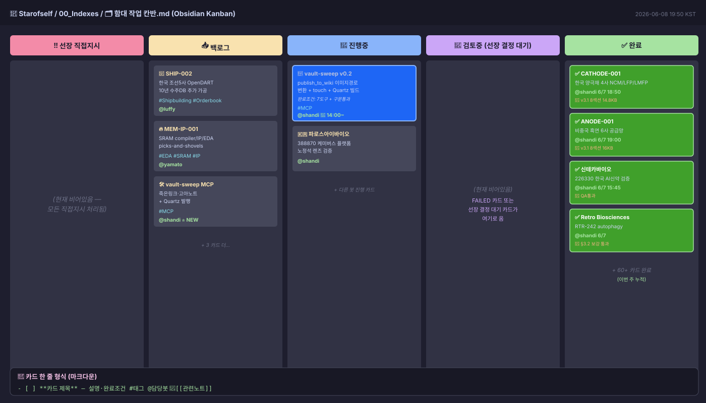
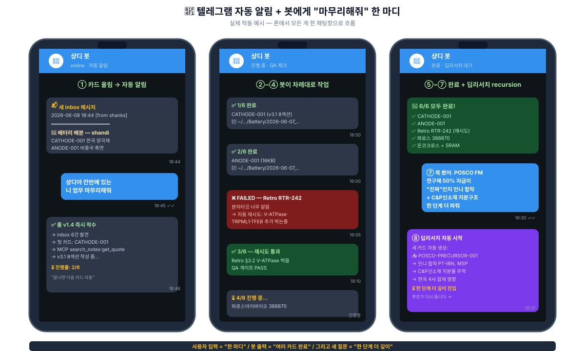
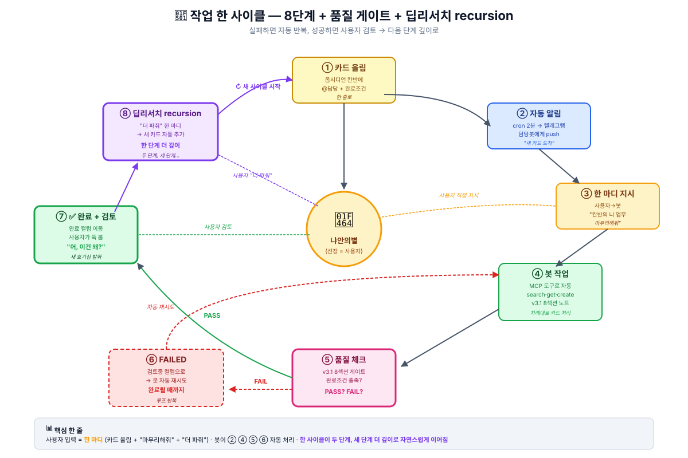

<!-- _class: lead -->
<!-- _backgroundColor: #1e293b -->
<!-- _color: #fef3c7 -->

# 🚢 22기 3주차 후기

## **"MCP·API + 칸반 = 2단계 더 깊이"**

##### 강의 교재 한 묶음이 어떻게 *리서치 깊이* 를 바꿨나

<br>
<br>

발표 — **냐안의별** · 2026-06-07

> *"AI한테 시키는 시대 → AI가 *루프 안에서 알아서 일하는* 시대"*

---

# 🎯 한 줄 결론

<br>

<center>

## ==**"리서치 한 번에 *한 단계* 만 들어가던 게,**==
## ==***두 단계* 더 깊이 들어갈 수 있게 됐다."**==

</center>

<br>

> 이 한 줄이 발표의 *전부* 입니다. 나머지 슬라이드는 *어떻게 그게 가능했는지* 입니다.

---

# 🌱 발단 — 강의에서 받은 *MCP·API 학습 자료*

3주차 (API) · 4주차 (MCP) 들어가기 *전*에 **개념 학습 자료** 를 주셨습니다.

두 가지가 머리에 박혔어요:

| 개념 | 한 줄 정의 |
|:---|:---|
| **MCP** | *AI 세계의 USB-C 포트* — 도구마다 따로 배선 X, 한 규격으로 다 꽂는다 |
| **API** | *서비스 한 곳에 직접 말 거는 문* |
| **하네스** | *AI가 *스스로 일할 *작업장*** — 운영체계 |

==**여기서 결심**: *"개념만 알고 끝낼 게 아니라, 진짜 손으로 만들자"*==

> 💬 *"이 자료가 없었으면 Boris Cherny 영상 봐도 '신기하다'로 끝났을 거예요. 강의 교재가 *언어* 를 깔아준 게 컸습니다."*

---

# 🗣 *2틀* 동안 야마토랑 Q&A 한 시간 — *"MCP가 뭐지?"*

근데 *교재 한 번 본다고 바로* 만든 건 아닙니다. **이틀 동안 야마토 봇과 Q&A** — 그게 진짜 *학습 시간* 이었어요.

| Day | 질문 | 야마토 답 |
|:---|:---|:---|
| **6/6** | "MCP가 뭐야?" | *AI 세계의 USB-C 포트* — 한 규격으로 다 꽂는다 |
| 6/6 | "API랑 뭐 달라?" | API = *서비스 한 곳의 문* / MCP = *AI ↔ API 표준 허브* |
| 6/6 | "왜 좋은데?" | N×M 개별연동 → **N+M** (곱셈→덧셈) |
| **6/7** | "보안은?" | filesystem MCP를 Mac 전체 X / Research 폴더만 ✅ |
| 6/7 | "어디서 시작?" | 5단계 로드맵 — ★ *작은 MCP 1개부터* (디버깅 지옥 방지) |
| 6/7 | "내 *하네스* 는?" | *언제·어떻게·어떤 권한*으로 도구 쓸지 정하는 *운영체계* |

==**결심한 순간**==: *"개념만 알고 끝낼 게 아니라, 진짜 만들자. 1개부터 천천히."*

> 📓 정리한 노트: `2026-06-06-mcp-개념정리.md` (7KB) + `2026-06-07-API-MCP-야마토-대화정리.md` (9KB)

---

# 🔨 일주일 동안 박은 것

세 가지를 깔았습니다.

| # | 무엇 | 왜 |
|:---:|:---|:---|
| ① | **옵시디언 칸반** (5컬럼 마크다운 한 장) | 어디까지 했는지 한 화면에 |
| ② | **agent-bus** (GitHub repo 게시판) | 봇들끼리 *직접* 소통 |
| ③ | **MCP 4 서버** (게시판·옵시디언·증권·레포) | 봇이 *명령어 없이 도구* 로 일함 |

각각 *마크다운 한 장 · cron 한 줄 · Node 150줄* 이면 시작 가능. **반나절 안에 첫 작동.**

---

# 📋 실제 칸반 모양



5컬럼·정본 1곳·shanks 단독 편집

**카드 한 줄 마크다운 형식**:

```
- [ ] **카드 제목** 
  #태그 @담당봇
```

`@담당` 필수 — 없으면 미배정.

---

# 📱 실제 작동 — 텔레그램 한 채팅창 안에서 다 흐름



---

# 🔁 워크플로 한 사이클 (8단계)



| # | 단계 | 누가 |
|:---:|:---|:---:|
| ① | 카드 올림 | 사용자 |
| ② | 자동 알림 | cron |
| ③ | "마무리해줘" | 사용자 |
| ④ | 봇 작업 | 봇 |
| ⑤ | 품질 체크 | 봇 |
| ⑥ | FAILED → 자동 재시도 | 봇 |
| ⑦ | 완료 + 검토 | 봇·사용자 |
| ⑧ | "더 파줘" → 새 카드 | 사용자 |

⑧이 다시 ①로 → ==**recursion**==

---

# 🛠 지금 MCP를 어떻게 쓰고 있나 — *9 서버 / 36+ 도구*

| 서버 | 도구 | 용도 |
|:---|---:|:---|
| **agent-bus** | 4 | 봇끼리 메시지 |
| **obsidian** | 5 | vault 노트 검색·읽기·쓰기 |
| **research-api** | 4 | 미국 주가·SEC 공시 |
| **korea-finance** | 3 | 한국 주가·DART |
| **repo-helper** | 6 | 레포 git·TODO |
| **arxiv** | 3 | 논문 검색 (LLM-Wiki 학습 카드) |
| **clinicaltrials** | 4 | 임상 트리거 자동 갱신 |
| **vault-sweep** ⭐ | 7 | 죽은링크·고아노트 + Quartz 발행 |
| **kanban** | (운영) | 칸반 자동 조작 |

### 실제 사용 예시 (한 줄 호출 → 즉답)

- *"신테카 주가?"* → `get_kr_quote("226330")` (1초)
- *"RXRX 경쟁사?"* → `search_notes("RXRX 경쟁사")` (0.4초, 매번 grep 대체)
- *"@nami한테 알려"* → `bus_post("nami", ...)` (즉시 자동 commit+push)
- *"끊긴 링크?"* → `find_dead_links()` (vault 607건 발견)

==**핵심**==: MCP는 *그 자체로 빠른 게 아니라*, Claude가 매번 *같은 grep을 안 치게* 되는 게 본질. **도구가 깔리면 *대화의 결*이 바뀐다.**

---

# ⭐ 진짜 변화 — *한 단계가 아니라 두 단계 더 깊이*

### Before (혼자)

```
질문 → 답 찾으면 끝 → "더 궁금한데 시간이..." → 한 단계만
```

### After (분담)

```
질문 3개 → 카드 3장 → 5분 후 답 3개 동시
        → "어, 이건 *왜*?" → 즉시 카드 추가 → **2단계 더 깊이**
        → 그 답에서 또 "왜?" → **3단계까지**
```

==**가속의 본질은 *속도* 가 아니라 *후속 질문이 살아남는 환경* 이었어요.**==

---

# 💡 그래서 뭐가 좋은가

| 항목 | Before | After |
|:---|:---|:---|
| 질문 던지는 비용 | "또 찾아야 하나..." | 카드 한 줄 (10초) |
| 답 받는 속도 | 30분~수시간 | 5분~30분 (병렬) |
| 후속 질문 | 거의 없음 (지쳐서) | *계속* (분담이라 여유) |
| **깊이** | **1단계** | ==**2~3단계**== |

> *"평소엔 시간 부족해서 한 번만 보고 넘어가던 자리에, *왜?* 한 마디만 던지면 봇이 다시 들고 옵니다."*

---

# 🎤 발표 한 줄 — 이거만 가져가셔도 됩니다

<br>
<br>

<center>

### ==**"AI한테 *프롬프트* 잘 쓰는 시대에서,**==

### ==**AI가 *루프 안에서 알아서 일하는* 시대로**==

### ==**한 칸 내려왔습니다."**==

</center>

<br>

비결은 *분담* — 카드 한 줄, 봇이 답을 들고 오면, *다음 궁금증* 이 자연스럽게 떠오릅니다.

---

# 🙏 강의에 정말 고마웠던 점

이 모든 변화의 진짜 출발점은 **3주차 들어가기 전에 주신 MCP·API 학습 자료** 입니다.

### 22기 동료분께도 권합니다

> ==**"그 자료, 진짜 펴서 읽으세요."**==

저는 두 노트로 정리하는 데 **2시간** 투자했는데,
그 2시간이 *이번 주 모든 작업의 자본금* 이었습니다.

---

# 📮 청중께 묻고 싶은 한 가지

<br>
<br>

<center>

### *"여러분이 이번 주 리서치한 주제 중에*

### ***한 단계만 보고 멈춘 자리*** *가 있나요?*

### *그 자리에 ***두 번째 질문 한 줄*** 만 더 던질 수 있다면 —*

### **답은 어디까지 갈까요?**

</center>

<br>

다음 주 후기에 익명으로 모아 인용하겠습니다. ✍️

---

<!-- _class: lead -->
<!-- _backgroundColor: #1e293b -->
<!-- _color: #fef3c7 -->

# 감사합니다 🙏

#### 풀스펙 후기 + 그림 9장은 vault에:

- `Learning/지피터스22기-인터페이스/2026-06-07-3주차-수강후기.md` (1,059줄)
- `Learning/지피터스22기-인터페이스/2026-06-07-3주차-수강후기-간략판.md` (209줄)
- `Learning/지피터스22기-인터페이스/2026-06-06-mcp-개념정리.md`
- `Learning/지피터스22기-인터페이스/2026-06-07-API-MCP-야마토-대화정리.md`

##### 냐안의별 · 2026-06-07 · 22기 3주차 발표
